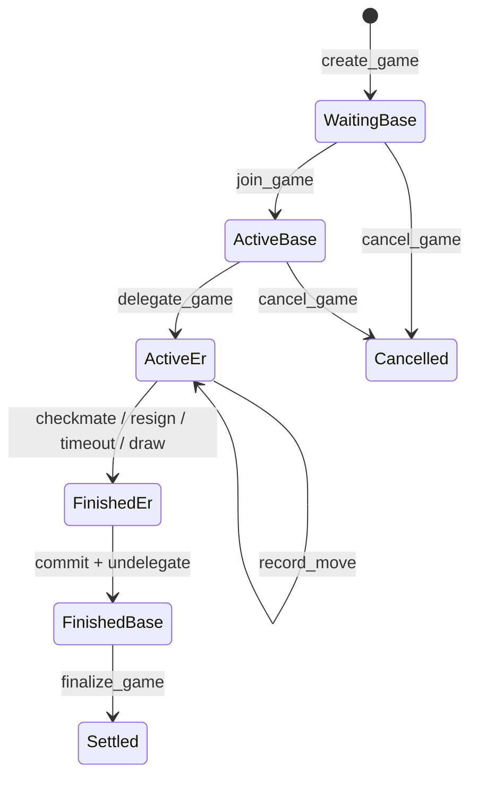

# MagicBlock Integration

XFChess uses MagicBlock Ephemeral Rollups for the latency-sensitive move path. The Solana `Game` PDA remains the lifecycle source of truth; MagicBlock is the fast execution layer for delegated game state. Escrow, treasury, profiles, ELO, and final payouts are settled back on the base layer after the delegated state is committed and undelegated.

## Pinned Stack

| Component | Version |
| --- | --- |
| Anchor | `0.31.1` |
| Solana | `2.2.1` |
| `ephemeral-rollups-sdk` | `0.13.0` |
| `magicblock-magic-program-api` | `0.3.1` |

The stack is pinned in `programs/xfchess-game/Cargo.toml`:

```toml
anchor-lang = { version = "=0.31.1", features = ["init-if-needed"] }
anchor-spl = "=0.31.1"
solana-program = "=2.2.1"
ephemeral-rollups-sdk = { version = "0.13.0", features = ["anchor"] }
magicblock-magic-program-api = { version = "=0.3.1", default-features = false, optional = true }
```

Do not treat `ephemeral-rollups-sdk` `0.15.x` as a drop-in upgrade. That line belongs with an Anchor 1.0 / Solana 3.x migration.

## Lifecycle



The boundary is deliberate:

- `create_game`, `join_game`, `cancel_game`, and `finalize_game` are base-layer flows.
- `delegate_game` moves the `Game` PDA into MagicBlock ownership.
- `record_move`, `resign`, and `claim_timeout` can run while delegated because they only write the `Game` PDA.
- `undelegate_game` commits ER state back to base and clears the program mirror flag.
- `finalize_game` runs only after undelegation and performs payout, fee reimbursement, ELO/profile updates, and settlement bookkeeping.

## Program Invariants

- MagicBlock is an execution layer, not a second source of truth.
- The `Game` PDA remains canonical for lifecycle and move state.
- `game.is_delegated` is the program-side mirror of delegation state.
- ER hot-path instructions write only delegated accounts. In v1, that means only the `Game` PDA.
- Instructions that write escrow, treasury, profile, or player lamports must reject delegated games.
- Terminal result instructions record `GameResult`; they do not move money.
- Settlement happens once, on base, after commit and undelegation.

Supporting docs:

- `docs/architecture/magicblock-game-lifecycle.md`
- `docs/adr/0001-split-terminal-result-from-settlement.md`
- `docs/adr/0002-magic-router-routing.md`
- `docs/runbooks/magicblock-lifecycle-devnet.md`
- `docs/runbooks/game-settlement.md`

## Delegating A Game PDA

The on-chain entrypoint is `programs/xfchess-game/src/delegation_ix/delegate.rs`.

`handler_delegate_game` manually deserializes the `Game` PDA, marks it delegated, serializes it back, and only then calls the MagicBlock CPI. The order matters because the CPI changes the account owner to the delegation program.

```rust
let mut game_data = ctx.accounts.game.try_borrow_mut_data()?;
let mut game = Game::try_deserialize(&mut &game_data[..])?;

require!(
    game.fee_payer == fee_payer.key(),
    GameErrorCode::FeePayerMismatch
);

crate::lifecycle::transitions::mark_delegated(&mut game)?;

let mut writer = &mut game_data[..];
game.try_serialize(&mut writer)?;
drop(game_data);

crate::magicblock::delegation::delegate_game_pda(delegate_accounts, &game_id_bytes)?;
```

The CPI wrapper lives in `programs/xfchess-game/src/magicblock/delegation.rs`:

```rust
pub fn default_delegate_config() -> DelegateConfig {
    DelegateConfig {
        commit_frequency_ms: ER_COMMIT_FREQUENCY_MS,
        validator: None,
    }
}

pub fn delegate_game_pda<'a, 'info>(
    accounts: DelegateAccounts<'a, 'info>,
    game_id_bytes: &[u8; 8],
) -> Result<()> {
    let seeds: &[&[u8]] = &[b"game", game_id_bytes];
    delegate_account(accounts, seeds, default_delegate_config())?;
    Ok(())
}
```

`validator: None` lets MagicBlock delegation or Magic Router choose the validator/region instead of pinning every game to one hard-coded validator.

## Recording Moves On The ER

After delegation, moves are routed through Magic Router or the configured ER endpoint. `record_move` writes the game account and verifies the session-key delegation:

```rust
#[derive(Accounts)]
#[instruction(game_id: u64)]
pub struct RecordMove<'info> {
    #[account(mut, seeds = [GAME_SEED, &game_id.to_le_bytes()], bump)]
    pub game: Account<'info, Game>,

    pub player: Signer<'info>,

    #[account(
        seeds = [
            b"session_delegation",
            &game_id.to_le_bytes(),
            session_delegation.player.as_ref(),
        ],
        bump = session_delegation.bump,
        constraint = session_delegation.session_key == player.key() @ GameErrorCode::InvalidSessionKey,
        constraint = session_delegation.enabled @ GameErrorCode::SessionExpiredOrDisabled,
    )]
    pub session_delegation: Account<'info, SessionDelegation>,
}
```

The handler applies the chess transition, checks the causal nonce, updates `Game`, and emits a move event:

```rust
apply::apply_recorded_move(
    game,
    moving_player,
    move_uci,
    next_board,
    nonce,
    parent_nonce,
    timestamp,
)?;

emit!(crate::events::MoveEvent {
    game_id,
    player: moving_player,
    move_uci,
    move_number: game.move_count,
    board_state: next_board,
    timestamp,
});
```

## Commit And Undelegate

When the game has a terminal result, `undelegate_game` commits ER state back to base and returns the `Game` PDA to normal program ownership.

```rust
let mut data = ctx.accounts.game.try_borrow_mut_data()?;
let mut game_struct = Game::try_deserialize(&mut &data[..])?;

crate::lifecycle::transitions::mark_undelegated(&mut game_struct)?;

let mut writer = &mut data[..];
game_struct.try_serialize(&mut writer)?;
drop(data);

crate::magicblock::delegation::commit_and_undelegate_game_pda(
    &ctx.accounts.payer.to_account_info(),
    &ctx.accounts.game.to_account_info(),
    &ctx.accounts.magic_context.to_account_info(),
    &ctx.accounts.magic_program.to_account_info(),
)?;
```

The handler pins the MagicBlock accounts:

```rust
#[account(mut, address = ephemeral_rollups_sdk::consts::MAGIC_CONTEXT_ID)]
pub magic_context: AccountInfo<'info>,

#[account(address = ephemeral_rollups_sdk::consts::MAGIC_PROGRAM_ID)]
pub magic_program: AccountInfo<'info>,
```

After undelegation, `finalize_game` performs the value-moving settlement on base.

## Routing: Base RPC vs Magic Router

Delegated accounts need different transaction routing than normal base-layer accounts. XFChess sends each instruction to a statically-known endpoint rather than inspecting delegation state per transaction — MagicBlock's own **Magic Router** (a hosted RPC that inspects writable-account ownership and forwards each tx to base or ER automatically) does the generic routing job; XFChess just needs to point ER-hot-path writes at it.

The actual call sites:

- `backend/src/signing/routes/main.rs` (`/vps/record_move`, `/vps/undelegate`) and `backend/src/tasks/settlement_worker.rs` (auto-undelegate) build their RPC client from `state.config.magic_router_rpc_url` — these are the only instructions that ever touch a delegated `Game` PDA.
- Everything else (`create_game`, `join_game`, `finalize_game`, tournament/treasury instructions) uses `state.config.solana_rpc_url` (base layer) directly, and the program rejects those instructions on a still-delegated game (see `programs/xfchess-game/src/magicblock/routing.rs`'s `GAME_WRITES_ONLY_ROUTING_INVARIANT`) — so there is no mixed delegated/non-delegated write to route.

Useful environment variables:

```bash
SOLANA_RPC_URL=https://api.devnet.solana.com
SOLANA_RPC_FALLBACK_URL=https://api.devnet.solana.com
ER_RPC_URL=https://devnet-eu.magicblock.app/
MAGIC_ROUTER_RPC_URL=https://devnet-router.magicblock.app
PROGRAM_ID=8tevgspityTTG45KvvRtWV4GZ2kuGDBYWMXouFGquyDU
```

`MAGIC_ROUTER_RPC_URL` and `MAGIC_ROUTER_URL` are optional overrides. If neither is set, the backend defaults `magic_router_rpc_url` to MagicBlock's devnet router (`https://devnet-router.magicblock.app`) — not to `ER_RPC_URL`.

## Web Client

The React frontend does not talk to base RPC or the ER directly — per `web-solana/CLAUDE.md`, all game transactions go through the backend API, which does the routing described above. There is no separate client-side delegation-aware routing layer to maintain in `web-solana/`.

## Backend Settlement Worker

The backend settlement worker watches active sessions, reads game state, undelegates delegated games when needed, and submits final settlement on base. Operationally, clients do not own the payout path.

Settlement flow:

1. Confirm the `Game` account has the expected phase and result.
2. If the game is delegated, undelegate before base-layer settlement.
3. Verify terminal instructions only set `GameStatus::Finished` and `GameResult`.
4. Run final settlement from the base layer.
5. Check escrow, treasury, player balances, ELO, and stats.

Never patch a payout with a one-off lamport transfer in an instruction handler. All settlement goes through the canonical settlement path.

## Failure Mode: ER Unavailability (Persistency)

XFChess aims for no single point of failure (see the persistency roadmap plan), and the ER dependency is the one gap that can't be closed from this repo alone.

Normal undelegation (`delegation_ix/delegate.rs`'s `handler_undelegate_game`) CPIs `commit_and_undelegate_accounts`, which only *schedules* work for the ER validator to execute — the transaction itself must still reach the ER. If the ER validator is unreachable, this path (and `claim_timeout`, and the crank-based idle checks, which also execute against the delegation-program-owned PDA via the ER) is equally unreachable. `ephemeral-rollups-sdk` 0.13.0 does expose a base-layer forced-undelegate builder (`dlp_api::instruction_builder::undelegate_confined_account`), but it's gated by a MagicBlock delegation-program **admin** key that XFChess does not hold — there is currently no self-serve way for XFChess to force a stuck delegated `Game` PDA back to base layer.

Mitigations actually available to us:

- **Shrink the exposure window.** The settlement worker commits+undelegates as soon as a game concludes (see above), so the time any given `Game` PDA sits delegated with funds at risk is normally minutes, not hours.
- **Monitor for it.** `xfchess_settlement_stale_delegated_gauge` (Prometheus, `/metrics`) counts currently-delegated games with no on-chain activity for more than 20 minutes (`STALE_DELEGATION_SECS` in `backend/src/tasks/settlement_worker.rs`) — a proxy for "the ER may not be committing/undelegating as expected." This turns a silent stuck-delegation incident into something on-call can see and act on (page, investigate, contact MagicBlock) — it does not and cannot auto-recover the game.
- **Track upstream.** Worth periodically checking whether MagicBlock exposes a self-serve or timeout-based forced-undelegate to dApp authorities in a future SDK version — that's the only real fix, and it's outside this repo's control.

## Live Devnet Validation

Use this flow when validating MagicBlock on devnet:

```text
create_game on base
join_game on base
authorize session keys
delegate_game on base
record_move through Magic Router / ER
record terminal result through legal move, resign, timeout, or draw
undelegate_game through MagicBlock commit + undelegate
verify base Game account mirrors ER result
finalize_game on base
verify escrow, treasury, balances, ELO, and stats
```

Program-test covers many instruction constraints, but it does not reproduce MagicBlock live delegation, asynchronous commit, and undelegation behavior. Use `docs/runbooks/magicblock-lifecycle-devnet.md` for live checks.
