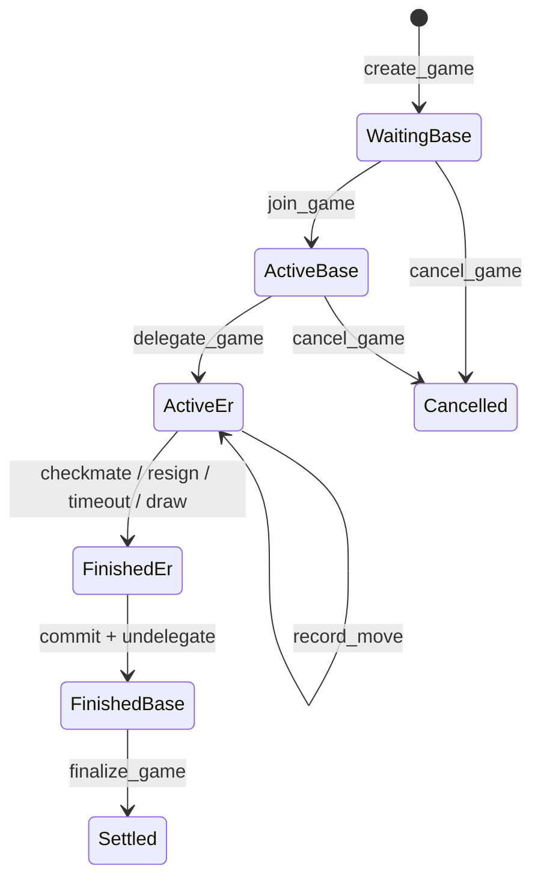

# MagicBlock Integration

XFChess uses MagicBlock Ephemeral Rollups for the latency-sensitive move path. The Solana `Game` PDA remains the lifecycle source of truth; MagicBlock is the fast execution layer for delegated game state. Escrow, treasury, profiles, ELO, and final payouts are settled back on the base layer after the delegated state is committed and undelegated.

## Pinned Stack

| Component | Version |
| --- | --- |
| Anchor | `0.31.1` |
| Solana | `2.2.1` |
| `ephemeral-rollups-sdk` | `0.13.0` |
| `magicblock-magic-program-api` | `0.3.1` |

The stack is pinned in `programs/xfchess-game/Cargo.toml`:

```toml
anchor-lang = { version = "=0.31.1", features = ["init-if-needed"] }
anchor-spl = "=0.31.1"
solana-program = "=2.2.1"
ephemeral-rollups-sdk = { version = "0.13.0", features = ["anchor"] }
magicblock-magic-program-api = { version = "=0.3.1", default-features = false, optional = true }
```

Do not treat `ephemeral-rollups-sdk` `0.15.x` as a drop-in upgrade. That line belongs with an Anchor 1.0 / Solana 3.x migration.

## Lifecycle



The boundary is deliberate:

- `create_game`, `join_game`, `cancel_game`, and `finalize_game` are base-layer flows.
- `delegate_game` moves the `Game` PDA into MagicBlock ownership.
- `record_move`, `resign`, and `claim_timeout` can run while delegated because they only write the `Game` PDA.
- `undelegate_game` commits ER state back to base and clears the program mirror flag.
- `finalize_game` runs only after undelegation and performs payout, fee reimbursement, ELO/profile updates, and settlement bookkeeping.

## Program Invariants

- MagicBlock is an execution layer, not a second source of truth.
- The `Game` PDA remains canonical for lifecycle and move state.
- `game.is_delegated` is the program-side mirror of delegation state.
- ER hot-path instructions write only delegated accounts. In v1, that means only the `Game` PDA.
- Instructions that write escrow, treasury, profile, or player lamports must reject delegated games.
- Terminal result instructions record `GameResult`; they do not move money.
- Settlement happens once, on base, after commit and undelegation.

Supporting docs:

- `docs/architecture/magicblock-game-lifecycle.md`
- `docs/adr/0001-split-terminal-result-from-settlement.md`
- `docs/adr/0002-magic-router-routing.md`
- `docs/runbooks/magicblock-lifecycle-devnet.md`
- `docs/runbooks/game-settlement.md`

## Delegating A Game PDA

The on-chain entrypoint is `programs/xfchess-game/src/delegation_ix/delegate.rs`.

`handler_delegate_game` manually deserializes the `Game` PDA, marks it delegated, serializes it back, and only then calls the MagicBlock CPI. The order matters because the CPI changes the account owner to the delegation program.

```rust
let mut game_data = ctx.accounts.game.try_borrow_mut_data()?;
let mut game = Game::try_deserialize(&mut &game_data[..])?;

require!(
    game.fee_payer == fee_payer.key(),
    GameErrorCode::FeePayerMismatch
);

crate::lifecycle::transitions::mark_delegated(&mut game)?;

let mut writer = &mut game_data[..];
game.try_serialize(&mut writer)?;
drop(game_data);

crate::magicblock::delegation::delegate_game_pda(delegate_accounts, &game_id_bytes)?;
```

The CPI wrapper lives in `programs/xfchess-game/src/magicblock/delegation.rs`:

```rust
pub fn default_delegate_config() -> DelegateConfig {
    DelegateConfig {
        commit_frequency_ms: ER_COMMIT_FREQUENCY_MS,
        validator: None,
    }
}

pub fn delegate_game_pda<'a, 'info>(
    accounts: DelegateAccounts<'a, 'info>,
    game_id_bytes: &[u8; 8],
) -> Result<()> {
    let seeds: &[&[u8]] = &[b"game", game_id_bytes];
    delegate_account(accounts, seeds, default_delegate_config())?;
    Ok(())
}
```

`validator: None` lets MagicBlock delegation or Magic Router choose the validator/region instead of pinning every game to one hard-coded validator.

## Recording Moves On The ER

After delegation, moves are routed through Magic Router or the configured ER endpoint. `record_move` writes the game account and verifies the session-key delegation:

```rust
#[derive(Accounts)]
#[instruction(game_id: u64)]
pub struct RecordMove<'info> {
    #[account(mut, seeds = [GAME_SEED, &game_id.to_le_bytes()], bump)]
    pub game: Account<'info, Game>,

    pub player: Signer<'info>,

    #[account(
        seeds = [
            b"session_delegation",
            &game_id.to_le_bytes(),
            session_delegation.player.as_ref(),
        ],
        bump = session_delegation.bump,
        constraint = session_delegation.session_key == player.key() @ GameErrorCode::InvalidSessionKey,
        constraint = session_delegation.enabled @ GameErrorCode::SessionExpiredOrDisabled,
    )]
    pub session_delegation: Account<'info, SessionDelegation>,
}
```

The handler applies the chess transition, checks the causal nonce, updates `Game`, and emits a move event:

```rust
apply::apply_recorded_move(
    game,
    moving_player,
    move_uci,
    next_board,
    nonce,
    parent_nonce,
    timestamp,
)?;

emit!(crate::events::MoveEvent {
    game_id,
    player: moving_player,
    move_uci,
    move_number: game.move_count,
    board_state: next_board,
    timestamp,
});
```

## Commit And Undelegate

When the game has a terminal result, `undelegate_game` commits ER state back to base and returns the `Game` PDA to normal program ownership.

```rust
let mut data = ctx.accounts.game.try_borrow_mut_data()?;
let mut game_struct = Game::try_deserialize(&mut &data[..])?;

crate::lifecycle::transitions::mark_undelegated(&mut game_struct)?;

let mut writer = &mut data[..];
game_struct.try_serialize(&mut writer)?;
drop(data);

crate::magicblock::delegation::commit_and_undelegate_game_pda(
    &ctx.accounts.payer.to_account_info(),
    &ctx.accounts.game.to_account_info(),
    &ctx.accounts.magic_context.to_account_info(),
    &ctx.accounts.magic_program.to_account_info(),
)?;
```

The handler pins the MagicBlock accounts:

```rust
#[account(mut, address = ephemeral_rollups_sdk::consts::MAGIC_CONTEXT_ID)]
pub magic_context: AccountInfo<'info>,

#[account(address = ephemeral_rollups_sdk::consts::MAGIC_PROGRAM_ID)]
pub magic_program: AccountInfo<'info>,
```

After undelegation, `finalize_game` performs the value-moving settlement on base.

## Routing: Base RPC vs Magic Router

Delegated accounts need different transaction routing than normal base-layer accounts. XFChess keeps the decision behind routing adapters.

Backend routing lives in `backend/src/signing/solana/routing.rs`:

```rust
#[derive(Clone, Copy, Debug, PartialEq, Eq)]
pub enum TxRoute {
    Base,
    MagicRouter,
}

pub fn magic_router_url(er_rpc_url: &str) -> String {
    std::env::var("MAGIC_ROUTER_RPC_URL")
        .or_else(|_| std::env::var("MAGIC_ROUTER_URL"))
        .unwrap_or_else(|_| er_rpc_url.to_string())
}

pub fn route_for_game_write(is_delegated: bool) -> TxRoute {
    if is_delegated {
        TxRoute::MagicRouter
    } else {
        TxRoute::Base
    }
}
```

Native client routing mirrors this in `src/solana/routing.rs`. Base settlement always uses base RPC. Game writes use Magic Router when delegated.

Useful environment variables:

```bash
SOLANA_RPC_URL=https://api.devnet.solana.com
SOLANA_RPC_FALLBACK_URL=https://api.devnet.solana.com
ER_RPC_URL=https://devnet-eu.magicblock.app/
MAGIC_ROUTER_RPC_URL=https://devnet-eu.magicblock.app/
PROGRAM_ID=8tevgspityTTG45KvvRtWV4GZ2kuGDBYWMXouFGquyDU
```

`MAGIC_ROUTER_RPC_URL` and `MAGIC_ROUTER_URL` are optional. If neither is set, the backend falls back to `ER_RPC_URL`.

## Web Client Dual Connections

The React frontend keeps both a base connection and an ER connection in `web-solana/src/lib/magicblock.ts`:

```ts
this.baseConnection = new Connection(BASE_LAYER_ENDPOINT, 'confirmed');

this.erConnection = new Connection(EPHEMERAL_ROLLUP_ENDPOINT, {
  wsEndpoint: EPHEMERAL_WS_ENDPOINT,
  commitment: 'confirmed',
});

const baseProvider = new AnchorProvider(
  this.baseConnection,
  wallet,
  { preflightCommitment: 'confirmed' },
);

const erProvider = new AnchorProvider(
  this.erConnection,
  wallet,
  {
    preflightCommitment: 'confirmed',
    skipPreflight: true,
  },
);
```

Delegation is detected by checking the base-layer account owner:

```ts
async isDelegated(pda: PublicKey): Promise<boolean> {
  const accountInfo = await this.baseConnection.getAccountInfo(pda);
  if (!accountInfo) return false;
  return accountInfo.owner.equals(DELEGATION_PROGRAM_ID);
}
```

That keeps the UI from guessing whether a move should be sent to base or to the ER.

## Backend Settlement Worker

The backend settlement worker watches active sessions, reads game state, undelegates delegated games when needed, and submits final settlement on base. Operationally, clients do not own the payout path.

Settlement flow:

1. Confirm the `Game` account has the expected phase and result.
2. If the game is delegated, undelegate before base-layer settlement.
3. Verify terminal instructions only set `GameStatus::Finished` and `GameResult`.
4. Run final settlement from the base layer.
5. Check escrow, treasury, player balances, ELO, and stats.

Never patch a payout with a one-off lamport transfer in an instruction handler. All settlement goes through the canonical settlement path.

## Live Devnet Validation

Use this flow when validating MagicBlock on devnet:

```text
create_game on base
join_game on base
authorize session keys
delegate_game on base
record_move through Magic Router / ER
record terminal result through legal move, resign, timeout, or draw
undelegate_game through MagicBlock commit + undelegate
verify base Game account mirrors ER result
finalize_game on base
verify escrow, treasury, balances, ELO, and stats
```

Program-test covers many instruction constraints, but it does not reproduce MagicBlock live delegation, asynchronous commit, and undelegation behavior. Use `docs/runbooks/magicblock-lifecycle-devnet.md` for live checks.
