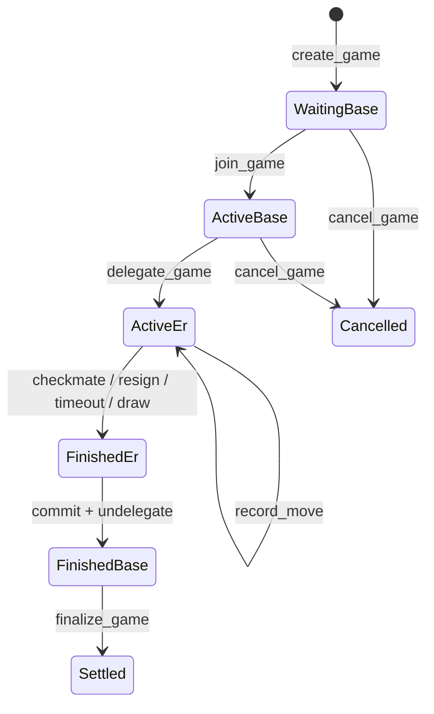

# MagicBlock Integration

XFChess uses MagicBlock Ephemeral Rollups for the latency-sensitive move path. The Solana `Game` PDA remains the lifecycle source of truth; MagicBlock is the fast execution layer for delegated game state. Escrow, treasury, profiles, ELO, and final payouts are settled back on the base layer after the delegated state is committed and undelegated.

## Pinned Stack

| Component | Version |
| --- | --- |
| Anchor | `1.1.2` |
| Solana | `3.0.0` |
| `ephemeral-rollups-sdk` | `0.16.2` |
| `magicblock-magic-program-api` | `0.13.11` |

The stack is pinned as workspace dependencies in the root `Cargo.toml`, and consumed by `programs/xfchess-game/Cargo.toml` via `{ workspace = true }`:

```toml
# root Cargo.toml [workspace.dependencies]
anchor-lang = { version = "=1.1.2", features = ["init-if-needed"] }
anchor-spl = "=1.1.2"
solana-program = "=3.0.0"
ephemeral-rollups-sdk = { version = "=0.16.2", features = ["anchor"] }

# programs/xfchess-game/Cargo.toml
magicblock-magic-program-api = { version = "=0.13.11", default-features = false, optional = true }
```

## Lifecycle


```mermaid
stateDiagram-v2
    [*] --> WaitingBase: create_game
    WaitingBase --> ActiveBase: join_game
    ActiveBase --> ActiveEr: delegate_game
    ActiveEr --> ActiveEr: record_move
    ActiveEr --> FinishedEr: checkmate / resign / timeout / draw
    FinishedEr --> FinishedBase: commit + undelegate
    FinishedBase --> Settled: finalize_game
    WaitingBase --> Cancelled: cancel_game
    ActiveBase --> Cancelled: cancel_game
```

The boundary is deliberate:

- `create_game`, `join_game`, `cancel_game`, and `finalize_game` are base-layer flows.
- `delegate_game` moves the `Game` PDA into MagicBlock ownership.
- `record_move`, `resign`, and `claim_timeout` can run while delegated because they only write the `Game` PDA.
- `undelegate_game` commits ER state back to base and clears the program mirror flag.
- `finalize_game` runs only after undelegation and performs payout, fee reimbursement, ELO/profile updates, and settlement bookkeeping.

## Program Invariants

- MagicBlock is an execution layer, not a second source of truth.
- The `Game` PDA remains canonical for lifecycle and move state.
- `game.is_delegated` is the program-side mirror of delegation state.
- ER hot-path instructions write only delegated accounts. In v1, that means only the `Game` PDA.
- Instructions that write escrow, treasury, profile, or player lamports must reject delegated games.
- Terminal result instructions record `GameResult`; they do not move money.
- Settlement happens once, on base, after commit and undelegation.

Supporting docs:

- `docs/architecture/magicblock-game-lifecycle.md`
- `docs/adr/0001-split-terminal-result-from-settlement.md`
- `docs/adr/0002-magic-router-routing.md`
- `docs/runbooks/magicblock-lifecycle-devnet.md`
- `docs/runbooks/game-settlement.md`

## Delegating A Game PDA

The on-chain entrypoint is `programs/xfchess-game/src/delegation_ix/delegate.rs`.

`handler_delegate_game` manually deserializes the `Game` PDA, marks it delegated, serializes it back, and only then calls the MagicBlock CPI. The order matters because the CPI changes the account owner to the delegation program.

```rust
let mut game_data = ctx.accounts.game.try_borrow_mut_data()?;
let mut game = Game::try_deserialize(&mut &game_data[..])?;

require!(
    game.fee_payer == fee_payer.key(),
    GameErrorCode::FeePayerMismatch
);

crate::lifecycle::transitions::mark_delegated(&mut game)?;

let mut writer = &mut game_data[..];
game.try_serialize(&mut writer)?;
drop(game_data);

crate::magicblock::delegation::delegate_game_pda(delegate_accounts, &game_id_bytes)?;
```

The CPI wrapper lives in `programs/xfchess-game/src/magicblock/delegation.rs`:

```rust
pub fn default_delegate_config() -> DelegateConfig {
    DelegateConfig {
        commit_frequency_ms: ER_COMMIT_FREQUENCY_MS,
        validator: None,
    }
}

pub fn delegate_game_pda<'a, 'info>(
    accounts: DelegateAccounts<'a, 'info>,
    game_id_bytes: &[u8; 8],
) -> Result<()> {
    let seeds: &[&[u8]] = &[b"game", game_id_bytes];
    delegate_account(accounts, seeds, default_delegate_config())?;
    Ok(())
}
```

`validator: None` lets MagicBlock delegation or Magic Router choose the validator/region instead of pinning every game to one hard-coded validator.

## Recording Moves On The ER

After delegation, moves are routed through Magic Router or the configured ER endpoint. `record_move` writes the game account and verifies the session-key delegation:

```rust
#[derive(Accounts)]
#[instruction(game_id: u64)]
pub struct RecordMove<'info> {
    #[account(mut, seeds = [GAME_SEED, &game_id.to_le_bytes()], bump)]
    pub game: Account<'info, Game>,

    pub player: Signer<'info>,

    #[account(
        seeds = [
            b"session_delegation",
            &game_id.to_le_bytes(),
            session_delegation.player.as_ref(),
        ],
        bump = session_delegation.bump,
        constraint = session_delegation.session_key == player.key() @ GameErrorCode::InvalidSessionKey,
        constraint = session_delegation.enabled @ GameErrorCode::SessionExpiredOrDisabled,
    )]
    pub session_delegation: Account<'info, SessionDelegation>,
}
```

The handler applies the chess transition, checks the causal nonce, updates `Game`, and emits a move event:

```rust
apply::apply_recorded_move(
    game,
    moving_player,
    move_uci,
    next_board,
    nonce,
    parent_nonce,
    timestamp,
)?;

emit!(crate::events::MoveEvent {
    game_id,
    player: moving_player,
    move_uci,
    move_number: game.move_count,
    board_state: next_board,
    timestamp,
});
```

## Commit And Undelegate

When the game has a terminal result, `undelegate_game` commits ER state back to base and returns the `Game` PDA to normal program ownership.

```rust
let mut data = ctx.accounts.game.try_borrow_mut_data()?;
let mut game_struct = Game::try_deserialize(&mut &data[..])?;

crate::lifecycle::transitions::mark_undelegated(&mut game_struct)?;

let mut writer = &mut data[..];
game_struct.try_serialize(&mut writer)?;
drop(data);

crate::magicblock::delegation::commit_and_undelegate_game_pda(
    &ctx.accounts.payer.to_account_info(),
    &ctx.accounts.game.to_account_info(),
    &ctx.accounts.magic_context.to_account_info(),
    &ctx.accounts.magic_program.to_account_info(),
)?;
```

The handler pins the MagicBlock accounts:

```rust
#[account(mut, address = ephemeral_rollups_sdk::consts::MAGIC_CONTEXT_ID)]
pub magic_context: AccountInfo<'info>,

#[account(address = ephemeral_rollups_sdk::consts::MAGIC_PROGRAM_ID)]
pub magic_program: AccountInfo<'info>,
```

After undelegation, `finalize_game` performs the value-moving settlement on base.

## Routing: Base RPC vs Magic Router

Delegated accounts need different transaction routing than normal base-layer accounts. XFChess sends each instruction to a statically-known endpoint rather than inspecting delegation state per transaction — MagicBlock's own **Magic Router** (a hosted RPC that inspects writable-account ownership and forwards each tx to base or ER automatically) does the generic routing job; XFChess just needs to point ER-hot-path writes at it.

The actual call sites:

- `backend/src/signing/routes/main.rs` (`/vps/record_move`, `/vps/undelegate`) and `backend/src/tasks/settlement_worker.rs` (auto-undelegate) build their RPC client from `state.config.magic_router_rpc_url` — these are the only instructions that ever touch a delegated `Game` PDA.
- Everything else (`create_game`, `join_game`, `finalize_game`, tournament/treasury instructions) uses `state.config.solana_rpc_url` (base layer) directly. These instructions all declare `game: Account<'info, Game>`, so Anchor's built-in owner check rejects them outright on a still-delegated game (its owner is the delegation program, not `crate::ID`) — there is no separate runtime guard for this, just Anchor's normal account validation. `programs/xfchess-game/src/magicblock/routing.rs`'s `GAME_WRITES_ONLY_ROUTING_INVARIANT` is a documentation-only constant (its own doc comment says so) marking this boundary in code, not an enforcement mechanism itself.

Useful environment variables:

```bash
SOLANA_RPC_URL=https://api.devnet.solana.com
SOLANA_RPC_FALLBACK_URL=https://api.devnet.solana.com
ER_RPC_URL=https://devnet-eu.magicblock.app/
MAGIC_ROUTER_RPC_URL=https://devnet-router.magicblock.app
PROGRAM_ID=8tevgspityTTG45KvvRtWV4GZ2kuGDBYWMXouFGquyDU
```

`MAGIC_ROUTER_RPC_URL` and `MAGIC_ROUTER_URL` are optional overrides. If neither is set, the backend defaults `magic_router_rpc_url` to MagicBlock's devnet router (`https://devnet-router.magicblock.app`) — not to `ER_RPC_URL`.

## Web Client

The React frontend does not talk to base RPC or the ER directly — per `xfchessdotcom/CLAUDE.md`, all game transactions go through the backend API, which does the routing described above. There is no separate client-side delegation-aware routing layer to maintain in `xfchessdotcom/`.

## Backend Settlement Worker

The backend settlement worker watches active sessions, reads game state, undelegates delegated games when needed, and submits final settlement on base. Operationally, clients do not own the payout path.

Settlement flow:

1. Confirm the `Game` account has the expected phase and result.
2. If the game is delegated, undelegate before base-layer settlement.
3. Verify terminal instructions only set `GameStatus::Finished` and `GameResult`.
4. Run final settlement from the base layer.
5. Check escrow, treasury, player balances, ELO, and stats.

Never patch a payout with a one-off lamport transfer in an instruction handler. All settlement goes through the canonical settlement path.

## Time-Check Crank (Ticking)

Chess-clock timeouts are enforced entirely on the ER via MagicBlock's scheduled-task
("crank") mechanism — no off-chain poller needed, matching the whitepaper's gasless
ticking model. See `programs/xfchess-game/src/crank_ix/README.md` for the on-chain
side (`schedule_time_check_crank`, `crank_time_check`, `cancel_time_check_crank`).

Backend wiring:

- `delegate_game` (`backend/src/signing/routes/main.rs`) submits
  `schedule_time_check` to the ER right after delegation confirms on base layer —
  30s interval, unlimited iterations until cancelled.
- `undelegate_game` and the settlement worker's auto-undelegate path
  (`backend/src/tasks/settlement_worker.rs`) both submit `cancel_time_check` as a
  best-effort follow-up after undelegating, so a finished game doesn't leave a
  dangling scheduled task on the ER.
- Both scheduling and cancellation are best-effort: a failure is logged and counted
  (`xfchess_time_check_scheduled_total` / `_schedule_failed_total` /
  `_cancelled_total` / `_cancel_failed_total` on `/metrics`) but never blocks the
  delegate/undelegate call it's attached to — those are the parts that matter for
  gameplay and fund settlement to continue.

Before this was wired up, `crank_time_check` had working forfeit logic but nothing
ever called it, and separately nothing called the permissionless `claim_timeout`
instruction either — a stalled clock just left the game `Active` indefinitely. This
does **not** touch the ER-unavailability gap below: it makes timeouts self-enforcing
while the ER is healthy, it doesn't provide a way to recover a game if the ER isn't.

## Failure Mode: ER Unavailability (Persistency)

XFChess aims for no single point of failure (see the persistency roadmap plan). The ER dependency was the one gap that couldn't be closed from this repo alone — as of this writing it's been closed with a self-serve, non-admin recovery path (below), though it's only ever been exercised in program-test, not against a real dead validator.

Normal undelegation (`delegation_ix/delegate.rs`'s `handler_undelegate_game`) CPIs `commit_and_undelegate_accounts`, which only *schedules* work for the ER validator to execute — the transaction itself must still reach the ER. If the ER validator is unreachable, this path (and `claim_timeout`, and the crank-based idle checks, which also execute against the delegation-program-owned PDA via the ER) is equally unreachable. The pinned `ephemeral-rollups-sdk` 0.16.2 re-exports (behind its `instruction` Cargo feature, now enabled) `dlp_api::instruction_builder::undelegate_confined_account`, a base-layer forced-undelegate gated by a MagicBlock delegation-program **admin** key that XFChess does not hold — not usable by us.

### The self-serve escape hatch

The same feature-gated module exposes a second, non-admin path, implemented in `delegation_ix/force_recovery.rs` and `governance_ix/recover_stuck_delegation.rs`:

1. **`request_force_undelegate`** (owner-program-authorized, no validator signature needed, callable any time) CPIs `request_undelegation`. Starts a `DEFAULT_UNDELEGATION_REQUEST_TIMEOUT_SLOTS` (9000 slots, ~60min) countdown on the delegation program.
2. **`force_undelegate_after_timeout`** (owner-program-authorized, no validator signature needed, callable once that window elapses) CPIs `undelegate_with_rollback_after_timeout`. **Data-loss warning, confirmed by reading the delegation program's actual processor source (`magicblock-labs/delegation-program`), not just its doc comment:** this does not apply the validator's pending commit, and does **not** preserve the account's own prior data either — it resizes the `Game` PDA to zero bytes and hands ownership back empty. It is a wipe, not a rollback to a good snapshot.
3. Because the `Game` PDA comes back with no discriminator, the normal `finalize_game` path can never run against it — there's no on-chain record left of who was playing or how much was staked. **`recover_stuck_delegation`** is the dedicated instruction for this dead end: it trusts the `dispute_authority` key (the same one that already single-handedly resolves disputes) to attest `white`/`black` from off-chain records (this game's own immutable `create_game`/`join_game` transaction history), verifies `game` is actually in the wiped state (owned by the program, zero data — so it can't be misused against a live game), and splits whatever is actually sitting in the escrow 50/50, mirroring `claim_stale_dispute`'s "no fault ruled" refund. It never touches ELO or profiles.

The wager escrow and treasury vault are separate PDAs from `Game` and are never delegated, so their lamports are untouched throughout all of this — what's actually at risk and recovered here is the *ability to release* those funds, not the funds' custody.

Backend wiring (`backend/src/tasks/settlement_worker.rs`): once a delegation is flagged stale (see the gauge below), the worker fires `request_force_undelegate` once (idempotent — safe to retry), then checks each tick whether the on-chain request has expired and, if so, submits `force_undelegate_after_timeout` automatically. Both try every fee-payer-pool key in turn, since the worker doesn't track which pool entry funded a given game's original `delegate_game` call — a wrong key just fails the CPI's `delegation_metadata.rent_payer` check harmlessly. `recover_stuck_delegation` is **not** auto-triggered: it needs a human (or an authorized off-chain process) to attest `white`/`black`, so it's a deliberate, dispute-authority-signed action rather than something a background loop should do unattended.

Mitigations actually available to us today:

- **Shrink the exposure window.** The settlement worker commits+undelegates as soon as a game concludes (see above), so the time any given `Game` PDA sits delegated with funds at risk is normally minutes, not hours.
- **Monitor for it.** `xfchess_settlement_stale_delegated_gauge` (Prometheus, `/metrics`) counts currently-delegated games with no on-chain activity for more than 20 minutes (`STALE_DELEGATION_SECS` in `backend/src/tasks/settlement_worker.rs`) — a proxy for "the ER may not be committing/undelegating as expected." It's also the trigger point for the self-serve recovery path above.
- **Recover it.** Once the ~60min window from `request_force_undelegate` elapses, the settlement worker completes the recovery on its own; releasing the escrow still needs a manual, dispute-authority-signed `recover_stuck_delegation` call.

## Live Devnet Validation

Use this flow when validating MagicBlock on devnet:

```text
create_game on base
join_game on base
authorize session keys
delegate_game on base
record_move through Magic Router / ER
record terminal result through legal move, resign, timeout, or draw
undelegate_game through MagicBlock commit + undelegate
verify base Game account mirrors ER result
finalize_game on base
verify escrow, treasury, balances, ELO, and stats
```

Program-test covers many instruction constraints, but it does not reproduce MagicBlock live delegation, asynchronous commit, and undelegation behavior. Use `docs/runbooks/magicblock-lifecycle-devnet.md` for live checks.
