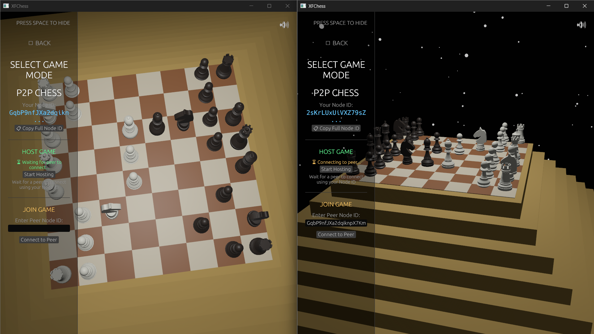

# XFChess

**Decentralized Chess with Ephemeral Rollups on Solana**

Play chess competitively with real stakes. Every move is recorded on-chain for provable fairness, powered by MagicBlock ER for sub-second gameplay.

<table align="center">
  <tr>
    <td width="400"></td>
    <td width="400"></td>
  </tr>
</table>

## Play a Wager Game

Start both player UIs:

```bash
magicblock_e2e_test.bat
```

**Player 1** (http://localhost:5173):
- Connect wallet → Create wager game → Copy Game ID

**Player 2** (http://localhost:5174):
- Connect wallet → Join with Game ID

**Both players:**
- Click "Launch Game" → Download session JSON
- Run: `launch_game_with_session.bat xfchess_session_<game_id>.json`

**Play!** Moves sync via Solana, winner receives payout.

## Architecture

```
┌─────────────────────────────────────────────────────────────────┐
│                         XFChess                                  │
├─────────────────────────────────────────────────────────────────┤
│                                                                  │
│  ┌──────────────┐      ┌──────────────┐      ┌──────────────┐  │
│  │   Website    │      │  Web Lobby   │      │ Native Game  │  │
│  │  (React)     │<---->|  (React +    |<---->|  (Bevy +     │  │
│  │  Marketing   │      │   Anchor)    │      │   Solana)    │  │
│  └──────────────┘      └──────────────┘      └──────────────┘  │
│         │                     │                     │          │
│         └─────────────────────┼─────────────────────┘          │
│                               v                                │
│                    ┌──────────────────────┐                   │
│                    │   Solana Devnet      │                   │
│                    │   Program: xfchess   │                   │
│                    └──────────────────────┘                   │
│                               │                                │
│                    ┌──────────────────────┐                   │
│                    │   MagicBlock ER      │                   │
│                    │   Ephemeral Rollups  │                   │
│                    └──────────────────────┘                   │
│                                                                  │
└─────────────────────────────────────────────────────────────────┘
```

## Project Structure

```
XFChess/
├── programs/xfchess-game/     # Solana smart contract
├── src/                        # Native game (Rust/Bevy)
│   ├── game/                   # Chess mechanics
│   ├── multiplayer/            # P2P networking
│   ├── solana/                 # Blockchain client
│   └── rendering/              # 3D graphics
├── web-react/                  # Marketing website
├── web-solana/                 # Game lobby/wallet
└── crates/                     # Shared libraries
```

## Key Features

- **Wager Games** - Bet SOL on chess matches
- **On-Chain Moves** - Every move recorded on Solana
- **P2P Networking** - Fast move relay via Iroh
- **MagicBlock ER** - Sub-second delegated gameplay
- **Session Keys** - Secure ephemeral signing
- **3D Graphics** - Beautiful chess board with Bevy

## Ephemeral Rollups Integration

XFChess leverages [MagicBlock Ephemeral Rollups](https://docs.magicblock.gg/) to achieve sub-100ms move latency while maintaining Solana's security guarantees.

### How It Works

```
┌─────────────────────────────────────────────────────────────────┐
│                         XFChess                                  │
├─────────────────────────────────────────────────────────────────┤
│                                                                  │
│   Session Key → Delegate Game → Play on ER → Undelegate         │
│        ↓              ↓              ↓            ↓             │
│   24hr expiry    MagicBlock      <100ms      Settlement        │
│   Local signing    ER Layer      moves       on Solana          │
│                                                                  │
└─────────────────────────────────────────────────────────────────┘
```

### Code Example: Delegating a Game

```rust
// programs/xfchess-game/src/instructions/delegate_game.rs
use ephemeral_rollups_sdk::cpi::{delegate_account, DelegateAccounts, DelegateConfig};

pub fn handler_delegate_game(
    ctx: Context<DelegateGameCtx>,
    _game_id: u64,
    valid_until: i64,
) -> Result<()> {
    let game = &ctx.accounts.game;
    
    // Only game participants can delegate
    require!(
        ctx.accounts.payer.key() == game.white ||
        ctx.accounts.payer.key() == game.black,
        XfchessGameError::UnauthorizedAccess
    );

    // Calculate PDA seeds
    let game_id_bytes = _game_id.to_le_bytes();
    let seeds: &[&[u8]] = &[b"game", &game_id_bytes, &[game.bump]];

    // Configure delegation
    let config = DelegateConfig {
        commit_frequency_ms: (valid_until as u32).saturating_mul(1000),
        validator: None, // Any available ER validator
    };

    // Execute delegation CPI via MagicBlock SDK
    delegate_account(delegate_accounts, seeds, config)?;
    Ok(())
}
```

### Code Example: Session Key Authorization

```rust
// programs/xfchess-game/src/instructions/session_delegation.rs
pub fn handler_authorize_session_key(
    ctx: Context<AuthorizeSessionCtx>,
    game_id: u64,
    session_pubkey: Pubkey,
) -> Result<()> {
    let session = &mut ctx.accounts.session_delegation;
    let player = &ctx.accounts.player;
    let game = &ctx.accounts.game;

    // Verify player is part of this game
    require!(
        player.key() == game.white || player.key() == game.black,
        XfchessGameError::UnauthorizedAccess
    );

    // Configure session delegation
    session.game_id = game_id;
    session.player = player.key();
    session.session_key = session_pubkey;
    session.expires_at = Clock::get()?.unix_timestamp + (2 * 60 * 60); // 2 hours
    session.max_batch_len = 10;
    session.enabled = true;

    Ok(())
}
```

### Frontend Integration

```typescript
// web-solana/src/hooks/useGameProgram.ts
const delegateGame = useCallback(async (gameId: BN) => {
    const [gamePDA] = deriveGamePDA(gameId)
    const validUntil = new BN(Math.floor(Date.now() / 1000) + 86400) // 24 hours

    const signature = await program.methods
        .delegateGame(gameId, validUntil)
        .accounts({
            game: gamePDA,
            payer: wallet.publicKey,
            ownerProgram: PROGRAM_ID,
            delegationProgram: DELEGATION_PROGRAM_ID,
        })
        .rpc()

    return { signature }
}, [program, wallet.publicKey])
```

### Benefits

- **<100ms move latency** - 10x faster than Solana mainnet
- **Zero wallet fatigue** - One approval per game, session keys handle moves
- **Base layer security** - Game state commits back to Solana
- **On-chain settlement** - Wager payouts execute on devnet

## Program ID

```
3D2EnKUfbev1HqU5rMLrZXXwJ4zxbtQ7hUiEYNMcojXP
```

Deployed on Solana Devnet.

## Building

### Prerequisites
- Rust 1.75+
- Node.js 18+
- Solana CLI (optional)

### Native Game
```bash
# Standard build (with Solana)
cargo build --release

# Without Solana (singleplayer only)
cargo build --release --no-default-features
```

### Web UIs
```bash
# Marketing site
cd web-react && npm install && npm run dev

# Game lobby
cd web-solana && npm install && npm run dev
```

## Documentation

Each folder contains detailed README:

- [`programs/xfchess-game/`](programs/xfchess-game/README.md) - Smart contract
- [`src/`](src/README.md) - Native game
- [`src/solana/`](src/solana/README.md) - Blockchain integration
- [`src/multiplayer/`](src/multiplayer/README.md) - P2P networking
- [`web-solana/`](web-solana/README.md) - Game lobby
- [`web-react/`](web-react/README.md) - Marketing site

## Testing

### Multiplayer Flow
```bash
# Start both UIs and test the full flow
magicblock_e2e_test.bat
```

### Solana Program
```bash
cd programs/xfchess-game
anchor test
```

### Native Game
```bash
# Singleplayer
cargo run

# With Solana session
cargo run -- --session-config session.json
```

## Technology Stack

- **Blockchain:** Solana, Anchor, MagicBlock ER
- **Game Engine:** Bevy (Rust)
- **P2P:** Iroh, Braid protocol
- **Frontend:** React, Vite
- **Contracts:** Rust (Anchor)

## License

MIT/Apache-2.0

## Links

- Website: https://xfchess.io (coming soon)
- Devnet: https://explorer.solana.com/address/3D2EnKUfbev1HqU5rMLrZXXwJ4zxbtQ7hUiEYNMcojXP?cluster=devnet
- MagicBlock: https://docs.magicblock.gg/

---

**Play Anywhere. Own your History.**
