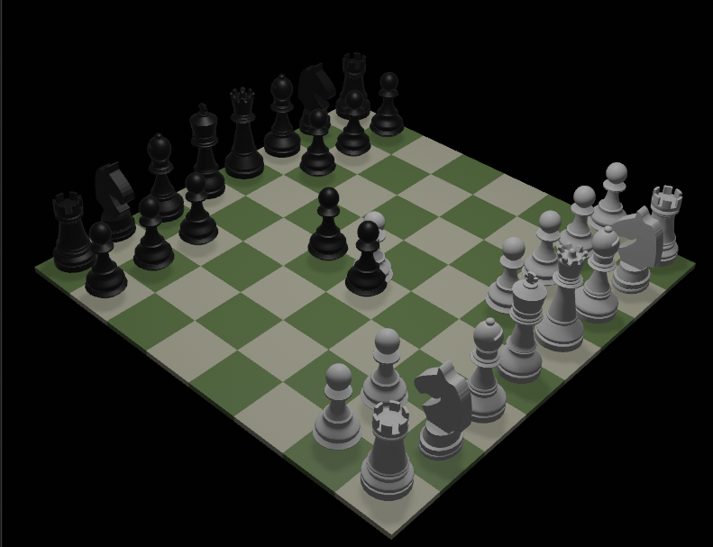

# XFChess

A modern chess game with blockchain integration built with Rust, Bevy, and Solana.

## Features

- **3D Chess Board**: Beautiful isometric 3D rendering with piece animations
- **Blockchain Integration**: Solana-based game history and move verification
- **Multiplayer Support**: Play against friends locally or online
- **Cross-Platform**: Windows, macOS, and Linux support

## Download

Get the latest release for your platform:
- [Download XFChess](https://github.com/trilltino/XFChess/releases)

## Community

Join our Discord community:
- [Join Discord](https://discord.gg/erZJCPCm)

## Development

Built with:
- **Rust** - Core game engine
- **Bevy** - 3D graphics and game framework
- **Solana** - Blockchain integration
- **React** - Web interface

## License

MIT/Apache-2.0
