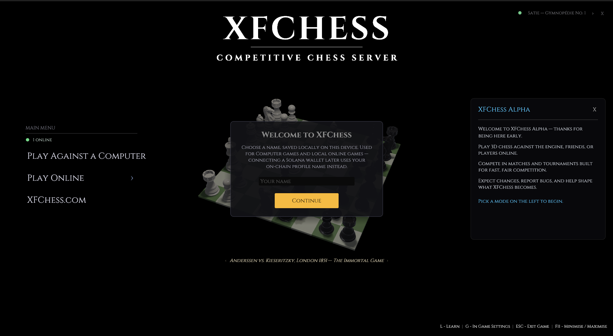
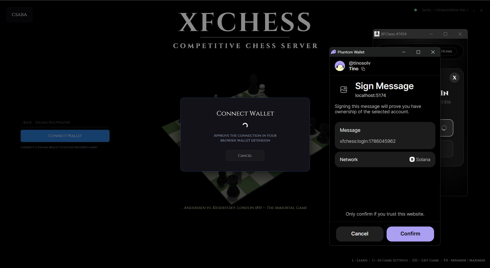
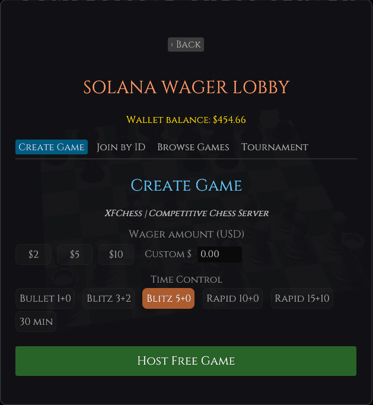
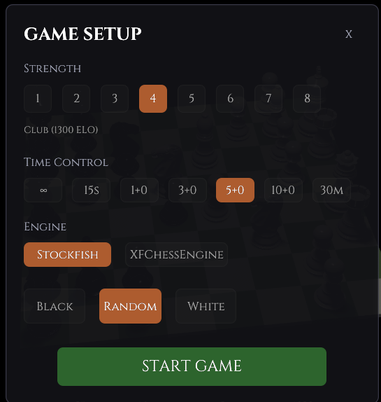
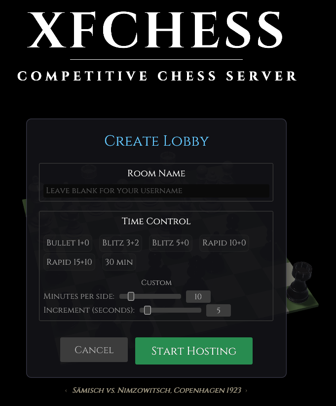
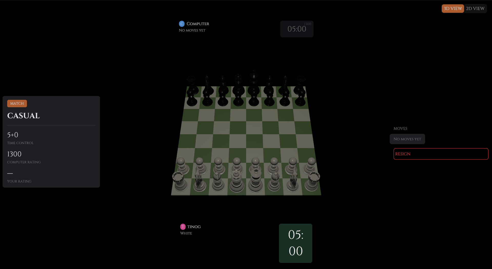
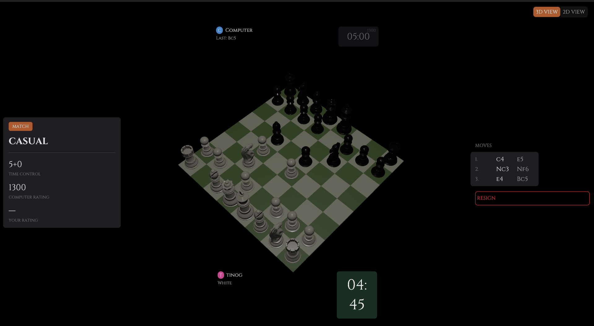
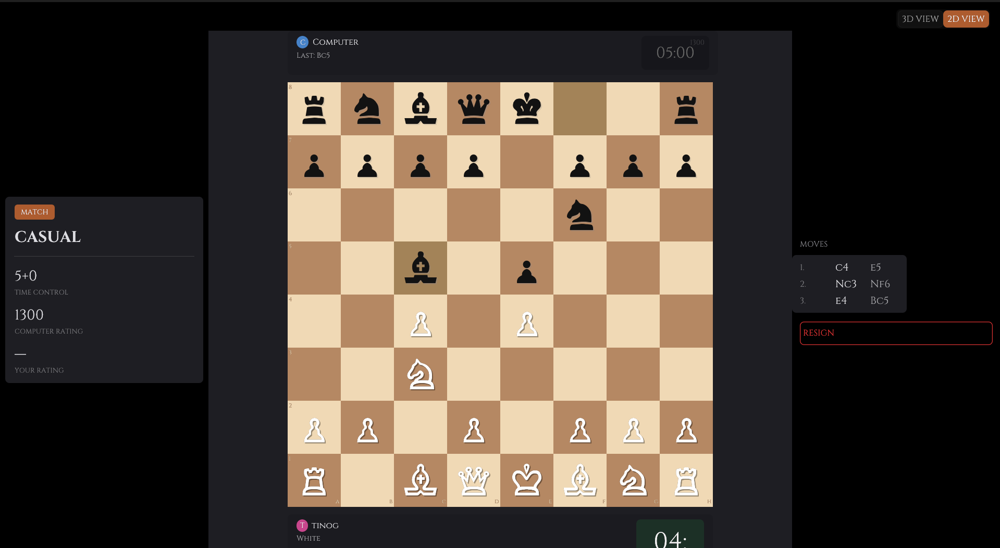

# XFChess

[](LICENSE)
[](https://github.com/trilltino/XFChess/actions/workflows/ci.yml)
[](https://github.com/trilltino/XFChess/actions/workflows/release.yml)
[](https://discord.gg/erZJCPCm)
[](https://github.com/trilltino/XFChess/stargazers)

**[Install](docs/INSTALL.md)** · **[MagicBlock Integration](MAGICBLOCK.md)** · [Contributing](CONTRIBUTING.md) · [Security](SECURITY.md) · [Environment Guide](docs/ENVIRONMENTS.md) · [Runbooks](docs/runbooks/) · [Full Docs Index](docs/README.md)

> Inspired by [*Ephemeral Rollups are All You Need*](https://arxiv.org/pdf/2311.02650).

XFChess is a forever-free, open source 3D chess platform: local play against a
built-in engine, online multiplayer and tournaments, and Solana-backed wagered
play with on-chain escrow, ELO, and dispute resolution — all in one client, no
separate "crypto mode."

It is not a chess client with crypto bolted on the side. For wagered games the
chess itself is on-chain:

> **Rust chess logic → on-chain authoritative rules → MagicBlock low-latency
> execution → Solana commit → base-layer settlement.**

## Architecture

Three layers, with a deliberate boundary between them:

1. **On-chain chess logic** — move generation, legality, check, checkmate, and
   the resulting board state are computed *inside the Solana program*, not by a
   trusted off-chain server.
2. **[MagicBlock](https://www.magicblock.gg/) Ephemeral Rollups** — the
   low-latency execution layer that live wagered games actually run on, so an
   authoritative on-chain move doesn't cost a base-layer confirmation.
3. **Solana base layer** — the canonical settlement and ownership layer: escrow,
   treasury, ELO, profiles, and final payouts.

**Solana remains the canonical settlement layer; MagicBlock is the fast
execution layer.** MagicBlock accelerates execution — it never becomes a second
source of truth.

### On-chain chess logic

**The chess game itself is validated on-chain.** XFChess uses the same
`nimzovich_engine` chess logic on the client and inside the Solana program via
`chess-logic-on-chain`, so move generation, legality, check, and checkmate are
not delegated to a trusted off-chain server.

The engine crate is `no_std`-compatible, which is what makes this possible — the
same Rust source compiles into two different roles:

| | Client engine | On-chain chess logic |
| --- | --- | --- |
| **Where** | native Bevy client | inside the Solana program (`move-validation` feature, on by default) |
| **What it does** | full alpha-beta search, evaluation, opening book | validates and applies the authoritative game-state transition |
| **Used for** | local single-player play, hints, instant UI feedback | deciding whether a move is legal and what the board becomes |
| **Where it executes** | the player's machine | on MagicBlock while the game is delegated, on base otherwise |

`record_move` does not take the client's word for the new position. It runs
`validate_and_apply` against the stored board, derives the next board itself,
and rejects the transaction unless the client's proposed board matches
(`GameErrorCode::InvalidBoardState`). Checkmate, stalemate, insufficient
material, and the 50-move rule are all detected in-program
(`programs/xfchess-game/src/moves_ix/apply.rs`).

Note the scope: the *chess rules and state transition* run on-chain. The full
alpha-beta search does not — `chess-logic-on-chain` pulls `nimzovich_engine`
with `default-features = false`, so the search module is never compiled into the
program. Search is a client concern; legality is a chain concern.

### Why MagicBlock?

Normal Solana transaction latency is not ideal for a real-time chess move path.
A blitz game cannot wait on base-layer confirmation for every move, but dropping
to an off-chain server would mean giving up exactly the property that makes
wagered play trustworthy.

XFChess therefore delegates the live `Game` PDA to MagicBlock Ephemeral Rollups.
While the game is delegated:

- moves execute through Magic Router / the ER
- the `Game` PDA is the delegated state being updated
- the on-chain chess transition remains authoritative
- session-key authorization remains enforced
- clock timeouts are enforced on the ER by a MagicBlock scheduled task ("crank")
- the game processes moves with low latency

When the game reaches a terminal result:

```text
MagicBlock ER
     |
     | commit state
     v
undelegate Game PDA
     |
     v
Solana base layer
     |
     +--> escrow settlement
     +--> treasury accounting
     +--> ELO/profile updates
     +--> final payout
```

No money moves inside the ER hot path. Terminal instructions record a
`GameResult`; `finalize_game` moves value, and it only runs on base after the
delegated state has been committed and undelegated.

See **[MAGICBLOCK.md](MAGICBLOCK.md)** for the full integration: pinned
versions, the delegation CPI, routing, the timeout crank, the settlement worker,
and the ER-unavailability recovery path.

### Full picture

```text
                         XFChess
                            |
             +--------------+--------------+
             |                             |
       Native Client                 Backend API
             |                             |
       nimzovich_engine                 builds tx
       alpha-beta search              (never signs)
             |                             |
             +-------------+---------------+
                           |
                    Solana / Anchor
                           |
                On-chain chess logic
                 (chess-logic-on-chain)
                           |
                     Game PDA
                           |
                    delegate_game
                           |
                           v
              +-------------------------+
              | MagicBlock Ephemeral    |
              | Rollup / Magic Router   |
              |                         |
              | Low-latency live moves  |
              | record_move             |
              | resign / timeout        |
              +-----------+-------------+
                          |
                    commit + undelegate
                          |
                          v
                   Solana base layer
                          |
             +------------+-------------+
             |                          |
        Game lifecycle             Settlement
                                        |
                             escrow / treasury
                             payouts / ELO
                             profiles / stats
```

### Execution vs settlement

```text
MAGICBLOCK / ER              SOLANA BASE LAYER
----------------             -----------------
Live game execution          Escrow
Move validation              Treasury
Game state transitions       Payouts
Clock / timeout execution    ELO
Terminal game result         Profiles
                             Settlement bookkeeping
```

This boundary is intentional. ER hot-path instructions write only delegated
accounts — in v1, only the `Game` PDA. Instructions that touch escrow, treasury,
profiles, or player lamports are rejected on a delegated game by Anchor's own
owner check, because a delegated `Game` PDA is owned by the delegation program
rather than by XFChess.

Casual and local games never touch the chain at all — Solana is opt-in, not a
hard dependency of the game. Every move in every mode is validated locally for
instant UI feedback; for wagered games it is validated *again* on-chain, and
that second result is the authoritative one.

## Built With

The native client is written in Rust on [Bevy](https://bevyengine.org/) (ECS,
3D rendering, [egui](https://github.com/emilk/egui) UI). Chess logic lives in
the `nimzovich_engine` crate described above. Multiplayer sync is peer-to-peer
over [Iroh](https://iroh.computer/) QUIC gossip, backed by a Rust port of the
[Braid-HTTP 209](https://braid.org/) streaming-subscribe protocol as a durable
server-side fallback and catch-up path, so moves, chat, and clock state still
replicate correctly even when a direct P2P link never establishes. The backend
is an async [Axum](https://github.com/tokio-rs/axum) server on Tokio, backed
by SQLite via [SQLx](https://github.com/launchbadge/sqlx); it builds Solana
transactions but never signs them — the player's wallet or a delegated
session key does that, client-side, so the backend never touches a private
key. On-chain game state, wager escrow, ELO, and tournaments run through an
[Anchor](https://www.anchor-lang.com/) program. The web frontend
(`xfchessdotcom/`) is [React](https://react.dev/) + [Vite](https://vite.dev/) +
[Chakra UI](https://chakra-ui.com/); the desktop build is wrapped with
[Tauri](https://tauri.app/). Production observability runs on
[Prometheus](https://prometheus.io/) + [Grafana](https://grafana.com/).

Just want to play? Grab a prebuilt build from
[Releases](https://github.com/trilltino/XFChess/releases) — see
[docs/INSTALL.md](docs/INSTALL.md) for per-platform steps (including the
SmartScreen/Gatekeeper prompts unsigned builds currently trigger). Single-player
against the engine works fully offline; online multiplayer, tournaments, and
wagered play need an internet connection and, for on-chain features, a Solana
wallet (Phantom or Solflare).










## Docs

- **[MagicBlock integration](MAGICBLOCK.md)** — ER delegation, Magic Router routing, commit/undelegate, settlement boundary
- [Install (Windows/macOS/Linux)](docs/INSTALL.md)
- [Contributing](CONTRIBUTING.md)
- [Security](SECURITY.md)
- [Code of conduct](CODE_OF_CONDUCT.md)
- [Environment guide](docs/ENVIRONMENTS.md)
- [Git workflow](docs/GIT_WORKFLOW.md)
- [Publishing a release](docs/PUBLISHING.md)
- [Runbooks](docs/runbooks/) — including the [MagicBlock devnet lifecycle runbook](docs/runbooks/magicblock-lifecycle-devnet.md)
- [Full docs index](docs/README.md) — ADRs, architecture deep dives, threat model, SLOs, capacity/scaling/DR plans

## Component Map

```text
Bevy client
  |-- local 3D chess, UI, input, animation, AI
  |-- Solana/session-key UX
  |-- Iroh/Braid realtime sync

Backend API
  |-- wallet auth, matchmaking, tournaments
  |-- signing routes, relay routes, settlement workers
  |-- metrics, logs, health checks

Solana program
  |-- game lifecycle, escrow, profiles, ELO
  |-- on-chain chess logic (chess-logic-on-chain)
  |-- tournaments, disputes, treasury
  |-- MagicBlock delegation and settlement boundaries

MagicBlock Ephemeral Rollups
  |-- delegated Game PDA
  |-- low-latency move recording
  |-- on-ER clock timeout crank
  |-- commit + undelegate before base-layer settlement
```

## Repo Map

Everything — game client, backend, Solana program, web frontend, and
deploy/ops tooling — lives in this one repository; there's no separate
private half.

| Path | Purpose |
| --- | --- |
| `src/` | Native Bevy game client |
| `backend/` | Axum backend and signing service — see [backend/README.md](backend/README.md) |
| `programs/xfchess-game/` | Anchor program |
| `crates/engine/` | Nimzovich chess engine |
| `crates/shared/` | Shared protocol, pairing, backend types, anti-cheat |
| `crates/solana/` | Solana helpers, on-chain chess logic, ER benchmarks |
| `crates/zarathustra_net/` | Braid/Iroh networking crates |
| `xfchessdotcom/` | React/Solana web frontend |
| `tauri/` | Desktop companion services and visualization tooling |
| `docs/` | Architecture notes, ADRs, plans, runbooks |
| `ops/` | VPS, nginx, staging, backend, monitoring config |

## Quick Start

### Prerequisites

- Rust stable
- Node.js 18+
- Solana CLI
- Anchor CLI matching `anchor-lang` 1.1.2 (see `programs/xfchess-game/Cargo.toml`)
- Docker and Docker Compose, optional but recommended for services

### Native Client

```bash
git clone https://github.com/trilltino/XFChess.git
cd XFChess
cargo run
```

Add `--features solana` to build with Solana wallet/wager support enabled.

### Build

```powershell
scripts\build.bat
scripts\build_program.bat
```

### Web Frontend

```bash
cd xfchessdotcom
npm ci
npm run dev
```

### Docker Services

```bash
docker-compose up -d
```

## Backend API

The backend (`backend/`) is what the native client and web frontend both talk
to for matchmaking, session-key auth, tournaments, and building (never
signing) Solana transactions — the player's wallet or a delegated session key
signs client-side, so a private key never reaches the server. It is also the
component that knows which endpoint a given instruction belongs on: ER
hot-path writes (`record_move`, `undelegate`) go through Magic Router, and
everything else goes to base RPC. It also serves a durable move/chat log over
the Braid-HTTP 209 streaming-subscribe protocol, which is how a game keeps
syncing even if the direct peer-to-peer link never comes up. See
[backend/README.md](backend/README.md) for the full route map, binaries, and
module layout.

- Health check: `GET /health`
- Metrics (Prometheus format): `GET /metrics`

## Development

Common checks:

```bash
cargo test
cargo test -p xfchess-game
cargo test -p nimzovich_engine
cargo fmt
cargo clippy
```

Solana program tests need a built program artifact:

```powershell
scripts\build_program.bat
cargo test -p xfchess-game --test er_move_tests
cargo test -p xfchess-game --test er_delegation_tests
cargo test -p xfchess-game --test game_settlement_tests
```

Program-test does not reproduce live MagicBlock delegation, asynchronous
commit, or undelegation behavior — use
[docs/runbooks/magicblock-lifecycle-devnet.md](docs/runbooks/magicblock-lifecycle-devnet.md)
for the live devnet validation flow.

See [CONTRIBUTING.md](CONTRIBUTING.md) for commit conventions, PR expectations,
and the AI-assisted-contribution disclosure policy.

## Features

- 3D Bevy chess board with animated pieces and UI
- Local play, online games, spectators, puzzles, and tournaments
- On-chain chess logic — move legality and terminal detection run inside the Solana program
- MagicBlock Ephemeral Rollups as the low-latency execution layer for live wagered games
- Solana Anchor program for game lifecycle, wager escrow, profiles, ELO, disputes, and treasury
- Session keys to avoid wallet popups on every move
- Backend signing service for auth, matchmaking, settlement, tournaments, and operations
- Iroh/Braid networking for realtime sync, with a durable backend fallback path
- Nimzovich chess engine and UCI binary
- FIDE Dutch Swiss tournament pairing
- Anti-cheat support crate and backend report storage
- Prometheus/Grafana observability and production runbooks

## Deployment

Deployment material lives in:

- `ops/README.md`
- `ops/backend/.env.example`
- `ops/staging/.env.staging.example`
- `docs/ENVIRONMENTS.md`
- `docs/PUBLISHING.md`
- `docs/runbooks/`

## Credits

[](https://github.com/trilltino/XFChess/graphs/contributors)

## Community

- Discord: [Join the community](https://discord.gg/erZJCPCm)
- Issues: [GitHub Issues](https://github.com/trilltino/XFChess/issues)
- Releases: [GitHub Releases](https://github.com/trilltino/XFChess/releases)

## License

XFChess is licensed under the GNU Affero General Public License v3.0. See [LICENSE](LICENSE).

If you run a modified XFChess network service, you must provide the corresponding source code to users of that service.
