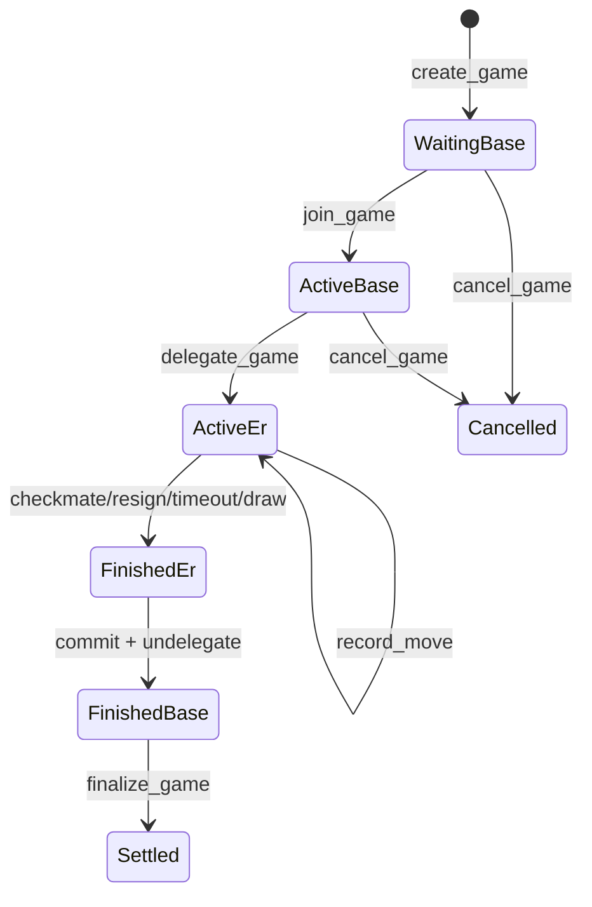

# MagicBlock Game Lifecycle

XFChess treats the Solana program as the lifecycle source of truth. MagicBlock is an execution layer for the delegated `Game` PDA, not a separate game state authority.

## Phases

`Game::phase()` derives the lifecycle phase from existing account fields: `status`, `is_delegated`, `result`, `black`, and `move_count`. This avoids a game account migration while giving handlers and tests one explicit state-machine vocabulary.

## Invariants

- Instructions that write escrow, profile, treasury, or player lamports must require `!game.is_delegated`.
- ER hot-path instructions should write only delegated accounts. For v1, that means the `Game` PDA.
- `is_delegated` is a program mirror of delegation state. Backends should still verify MagicBlock delegation ownership/records when routing and syncing.
- Terminal result recording and settlement converge on one settlement path. `resign`, `claim_timeout`, crank timeout, and checkmate/draw detection only record `GameResult`; `finalize_game` performs money/profile settlement on base after undelegation.

## Instruction Contracts

- `create_game`: create `WaitingBase`.
- `join_game`: `WaitingBase -> ActiveBase`.
- `delegate_game`: `ActiveBase -> ActiveEr` and delegate the `Game` PDA.
- `record_move`: `Active* -> Active*` or `Finished*`, mutating only `Game`.
- `resign`: `Active* -> Finished*`, mutating only `Game`.
- `claim_timeout`: `Active* -> Finished*`, mutating only `Game`.
- `undelegate_game`: delegated phase to base phase after commit.
- `finalize_game`: `FinishedBase -> Settled`, with all money/profile effects.
- `cancel_game`: base-only refund path before meaningful play.
