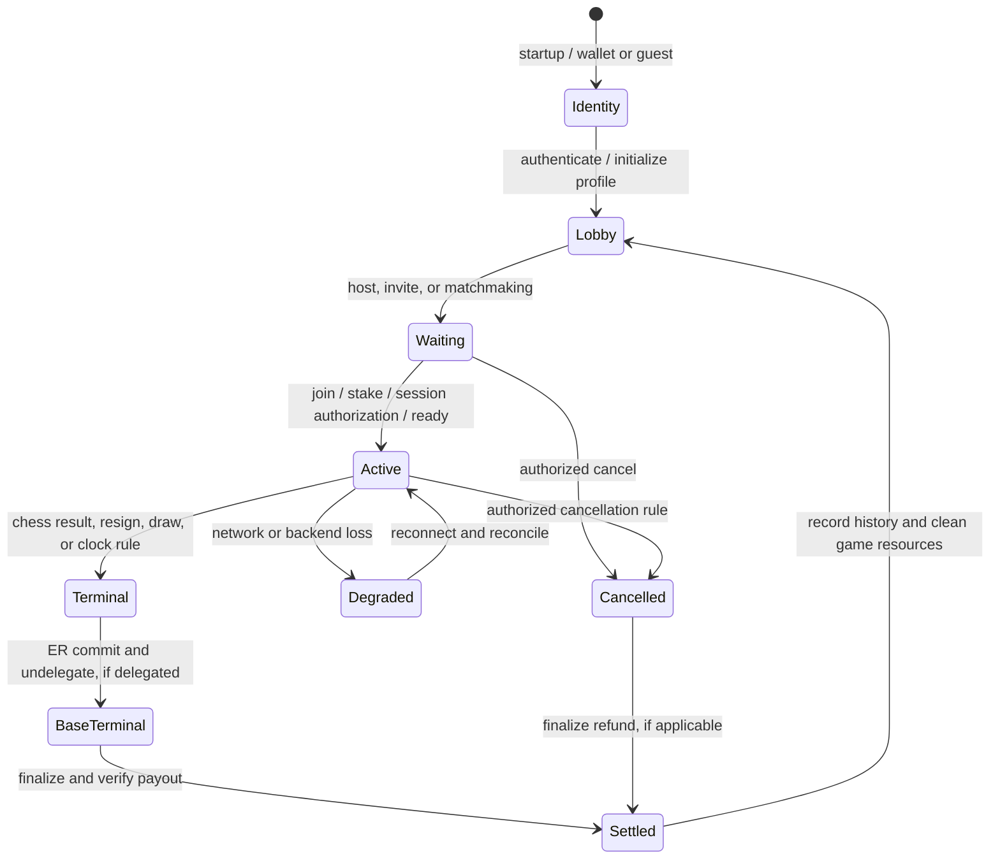

# Multiplayer lifecycle audit (9 October 2026)

Audited baseline: `b34518000d1e4257c333417a29138f111a0752c1`. The checkout already contained unrelated tournament and admin changes; this audit did not edit them. Scope: client transport and lifecycle, backend event log/relay/settlement, on-chain lifecycle, and MagicBlock recovery. This is a code audit with targeted fixes, not proof of a live two-player release.

## Authority and lifecycle

The Game PDA is authoritative for wagered chess position, result, delegation, and escrow. MagicBlock executes delegated Game writes; settlement runs on Solana base after commit and undelegation. The SQLite `game_event_log` is a durable transport/catch-up log, not a substitute for a Game PDA. Casual games have no Game PDA: clients exchange moves over Iroh gossip and the backend Braid log. The lobby JOIN_ACK registry is process-local. The settlement worker scans persisted active sessions and checks Game accounts; no transport disconnect by itself authorizes a result.

| Phases | Source of truth; local/backend/chain state | Allowed advance, signatures, retry and recovery | Player view; funds |
|---|---|---|---|
| 1-5 startup, connectivity, identity, auth, profile | Wallet or guest identity and backend auth/profile; no Game PDA | Reauthenticate on restart; never inherit a previous wallet's protected game | Sign-in and profile state; no game funds yet |
| 6-10 lobby, host, challenge, matchmaking, create, discover, join | Backend lobby and session records; Game PDA after on-chain creation | Wallet signs create/join for wagered games; cancel and join race must resolve through one authority | Searching/waiting/connecting; stake may be pending |
| 11-15 stake, session keys, delegation, readiness, start | Game PDA and account owner; client barrier and backend session are mirrors | Wallet authorizes stake/session; delegation requires valid fee payer and owner checks; retry uncertain transactions only after account/signature check | Waiting/ready; escrow can be locked |
| 16-18 first/ordinary move, acknowledgement | Game PDA on wagered play; Iroh/Braid and client board are delivery/rendering layers | Session key signs move; nonce, parent and board must match; gaps require catch-up before later application | Pending versus confirmed move; funds unchanged |
| 19-22 degradation, disconnect, reconnect, restart | Existing Game PDA and persisted log/session, then local board | Retry transport and auth; reconcile canonical result and nonce; never infer resignation from network loss | Reconnecting/resume or actual terminal result; escrow stays locked |
| 23-28 resign, draw, timeout, abandonment, cancel, chess termination | Game PDA terminal status/result for wagered play | Correct player/program authority; zero-move timeout cancels without a winner; terminal transitions must be one-way | Exact end reason; payout remains pending |
| 29-31 ER commit, undelegation, settlement, refund/payout | Delegated owner and ER state until commit; base Game PDA and transaction for money | Worker retries from persisted sessions; verify owner/result and signature on uncertain outcome | Settlement pending/confirmed/recovery; funds affected here |
| 32-35 rating/history, game-over, lobby, next game | Settled Game PDA and persisted history; game-scoped client resources cleared | Record once after authoritative result; late events must match game ID | Final result and next-match entry |

## Findings and changes

| Severity | Confirmed path and player effect | Action |
|---|---|---|
| High | `src/multiplayer/network/reorder.rs::expire` advanced `expected` to the largest buffered nonce plus one after a gap. When the missing move was lost, a later move could be released against the old board before a snapshot was applied. | Fixed the unsafe skip: expiry drops unverified buffered moves and retains the missing cursor. Regression test exercises overflow and a later arrival. A truly lost move still needs authoritative nonce reconciliation to regain liveness. |
| High | `backend/src/signing/routes/game_log.rs::put_event_with_session`: a stored write with lost HTTP acknowledgement retried against a newer head, got parent mismatch, and the client re-chained the same event into a second log row. | Fixed: same version and payload returns original sequence before parent validation; conflicting reuse gets 409. Regression test covers a retry after another event advances the head. |
| High | `backend/src/signing/routes/game_log.rs::casual_identity_check`: accepted host/joiner IDs were process-local. After backend restart, the claim check could fall back to first claimant. | Fixed: accepted pair is immutable in SQLite migration `032_casual_game_participants.sql`, loaded after restart; lookup errors reject claims. Regression test covers restart and attempted replacement. Existing games accepted before this migration have no persisted pair. |
| Critical | `backend/src/signing/routes/game_log.rs::verify_claim`: an unavailable on-chain participant lookup for a numeric game ID could reach the casual first-claimant fallback. An RPC outage could thus admit an unverified move-log writer. | Fixed: numeric game IDs with configured on-chain participant verification fail closed unless a previously accepted casual pair verifies the claimant. The RPC-unavailable regression test passed in the backend library suite. |
| High | `backend/src/signing/p2p_relay/routes.rs::leave_game` marked an in-progress casual room Finished when the host left, or reopened it to a new joiner when the joiner left. A transport/window exit could therefore impersonate a game result or admit a third player. | Fixed: relay leave no longer changes an in-progress room's status or participants. An explicit game result still needs its own authoritative path. |
| Medium | `src/multiplayer/systems.rs::reset_multiplayer_session_state` left nonce buffers and gap timers alive after a game. A subsequent game in the same process could inherit stale state. | Fixed: clear both maps on match exit. |
| High | `src/multiplayer/systems.rs::handle_game_control_messages` accepted draw, timeout, rematch and ping messages without checking the active game ID. A late timeout from game A could affect game B. | Fixed: require an active session and matching game ID before dispatch; added a focused regression test. |
| High | `src/multiplayer/systems.rs::handle_resync_response` applied a peer FEN without checking game ID or age; `handle_resync_request` sent `committed_turn: 0`. A delayed snapshot could overwrite a newer position. | Fixed the immediate overwrite: match the active game, reject stale/conflicting ply, send the FEN-derived turn, and refuse peer-FEN resync for on-chain games. Authoritative chain/ER catch-up remains a release blocker. |
| High | `backend/src/tasks/settlement_worker.rs` deactivated an active session when a batched RPC call returned `None`, including startup reconciliation. A missing/closed account does not prove funds were resolved. | Fixed in two steps. Pass 1 retained every missing-PDA session, but `finalize_game` closes the Game PDA (`close = fee_payer`), so that kept every settled game active and re-fetched forever. Pass 2 adds `reconcile_missing_games`: a session is retired only when it is older than 10 minutes and the wager escrow PDA holds at most 5,000 lamports of dust. Held escrow logs an operator-recovery error; RPC failure changes nothing. Three unit tests. |
| Critical | `src/ui/game/game_ui.rs::opponent_disconnect_ui` converted 20 seconds of transport loss into a local timeout result and a possible `claim_timeout` transaction, despite the program's timed-game inactivity window being 90 seconds. | Fixed: transport loss now shows a reconnecting banner without changing the game result or submitting a timeout claim. Chess-clock and on-chain timeout paths remain separate. |
| High | `src/game/systems/first_move_timer.rs` applied a 30-second local zero-move abort to on-chain games, while the program applies its own inactivity rule. A local client could show an end state before the Game PDA did. | Fixed: the local first-move deadline is disabled for a known on-chain game; the on-chain zero-move cancellation rule remains authoritative. |
| High | `programs/xfchess-game/src/game_ix/cancel.rs`: after an active game had moves and was idle for 24 hours, the cancel branch checked age but not whether the signer was white or black. An outsider could force cancellation and refunds. | Fixed: both active-game cancellation branches require a participant. The unit test passed. This requires a program upgrade before deployed games receive the protection. |
| High | `src/multiplayer/solana/lobby.rs`: missing or malformed Game account was reported as “nothing to refund”; finished/cancelled status could clear the local recovery ledger. The submit helper also returns a signature as success after a two-second confirmation deadline, so cancellation could say “Wager refunded” while execution was unknown. | Fixed these cancellation prechecks and require a confirmed signature before clearing recovery or saying refunded. A still-unknown signature is surfaced with its ID. Escrow-balance reconciliation and other submit-helper callers remain unverified. |
| High | `src/multiplayer/solana/wager_recovery.rs` discovered only IDs in `wagered_games.json` and read binary offsets (the fixed `8 + 212` wager offset is wrong whenever `result` is `Winner`, which shifts later fields by 32 bytes). Its `spawn_scan` was never called anywhere, so no in-app path to stranded stakes existed. | Fixed. The scan merges `getProgramAccounts` (memcmp on the Game discriminator plus wallet as white or black) with the ledger (which still covers delegated games). It decodes with the program's own `Game` type (`try_deserialize`) and classifies each game against the program's `cancel_game` rules. The lobby now runs it on wallet change and after each cancellation, and offers **Reclaim** only for states the program accepts. An RPC failure shows "could not fully check". `cancel_game_on_chain` uses the same decoder and reconciles an already-cancelled game from its escrow balance instead of erroring. Seven unit tests. |
| High, open | `src/multiplayer/network/online_game_session.rs::start_session` resets `next_nonce` and move number to one for a new process. No durable per-game cursor was confirmed in this audit. | Release blocker for restart resume: restore from authoritative game state/log before allowing a new move. |
| High | `src/multiplayer/network/vps/game.rs::get_active_game_for_wallet` called an unregistered backend URL and the lobby converted failures into “no game.” The old Rejoin button entered gameplay with a fresh board/nonce. | Fixed discovery: `/games/active/{wallet}` checks persisted session IDs against Game PDA owner, decoded status and participant wallets; database/RPC failures surface as unknown. Wallet changes clear any prior lookup. Removed the unsafe Rejoin action until game state, auth/session and nonce can be restored. Actual resume remains a release blocker. |
| High, open | `src/multiplayer/network/online_game_session.rs::publish_local_move` increments a local nonce while `src/multiplayer/systems.rs` sequences received moves per game. The two players can assign the same nonce independently; a gap expiry now safely stops rather than skipping, but may remain stalled. | Release blocker: define one shared authoritative move index and resume/rebase protocol, then test two independent clients over both transports. |
| High | `src/multiplayer/rollup/bridge.rs` accepted peer `Committed`/`ResyncResponse` values straight into `rollup_manager.committed_fen/turn`; `rollup/manager.rs` did the same for `SnapshotReceived`/`ResyncedMove`. A delayed or replayed message could rewind the baseline that batch validation and the snapshot sent to new peers depend on. | Fixed. All four paths go through `accept_peer_baseline`/`accept_resynced_move`, which order by the FEN's own ply (side to move + fullmove), not the inconsistent `committed_turn` counter. Stale positions are ignored, and a different position at the same ply marks the game `OutOfSync` instead of overwriting. `assign_game` resets the baseline whenever a different game ID is assigned. Six unit tests. Not verified against the Game PDA; the on-chain `record_move` validation remains the authority. |
| Critical | `src/multiplayer/rollup/bridge.rs::spawn_finalization_task`: when `/game/finalize` failed, it sent `FinalizationResult::default()`, and `apply_finalization_result` set `payout_confirmed = true` unconditionally. A failed settlement showed "Prize claimed ✓". A successful HTTP response was also never checked on chain. | Fixed. The result carries a `SettlementStatus` derived only from chain evidence: the finalize signature confirmed, or the Game PDA closed (only `finalize_game` closes it). Otherwise the popup shows "Settlement pending: …", and the worker keeps retrying server-side. Two unit tests. |
| High | `backend/src/signing/routes/main.rs::active_game_for_wallet` (added in pass 1) skipped any account not owned by the game program. A game in play on the ER is owned by the delegation program on the base layer, so the normal wagered in-play state was reported as "no active game". | Fixed: delegation-program-owned accounts are accepted (the data is still the Game layout). |
| Medium | `backend/tests/e2e_api.rs`: four tests asserted pre-hardening behaviour: anonymous blur telemetry, relay-secret-only `record_move`, and a shell-string treasury command. | Tests updated to assert the hardened behaviour: relay secret without a wallet identity gets 401, blur needs a JWT and a participant, and the treasury hand-off is structured args. Added `blur_telemetry_requires_a_wallet_identity`. Suite: 20/20. |
| Medium, open | `backend/src/signing/p2p_relay/` keeps the lobby JOIN_ACK registry in memory. Restart discards pending lobby handshakes, though the game event log survives. | Reannounce/rediscover protocol needs a two-client restart test. |

The fixed SQLite pair protects games accepted after migration. Its node ID is still a transport identity; casual play's cryptographic identity and multi-device policy need a separate protocol review. The initial `OnChainCheck::Unavailable` fallback still trusts the first two claims for direct games without an accepted JOIN_ACK pair.

## Verification

| Check | Result |
|---|---|
| `rustc --edition 2021 --test src/multiplayer/network/reorder.rs` | Pass: 7 tests, including duplicate/reorder/gap and 500 randomized dual-transport trials. Isolated helper proof only. |
| SQLite migration and immutable pair SQL via Node `node:sqlite` | Pass: table created and a second claimant could not replace the persisted joiner. SQL smoke proof only. |
| `rustfmt --edition 2021 --check` on edited Rust files | Pass. |
| `git -c core.whitespace=cr-at-eol diff --check` | Pass. |
| `xfchessdotcom`: `npm run lint`, `npm run build` | Pass; Vite built 2,202 modules and prerendered 4 routes. These checks do not exercise the Bevy client. |
| `cargo fmt --all -- --check` | Failed: numerous pre-existing formatting differences in tournament/admin/Tauri files. Unrelated files were not reformatted. |
| `cargo build-sbf` (program at working tree) + `cargo test -p xfchess-game --no-fail-fast` | Pass: 153 passed, 0 failed, 5 ignored across all program suites. That includes the in-process BanksClient (`solana-program-test`) suites, e.g. `claim_timeout_cancels_zero_move_game_instead_of_awarding_black`, `finalize_game_refunds_cancelled_zero_move_game_to_both_players`, `finalize_game_cannot_be_replayed_to_double_apply_elo`, and the delegation spoofing tests. Without the built `.so` in `target/deploy`, 52 of these panic with "Program file data not available" (an environment prerequisite, not a code failure). |
| `cargo test -q -p backend --lib` | Pass: 246 passed, 1 ignored (adds the three missing-PDA reconciliation tests). |
| `cargo test -q -p backend --test e2e_api` | Pass: 20/20 after updating four stale tests (see findings). In-process API tests, not two-client tests. |
| `cargo check -q -p xfchess --lib --features solana` | Pass (warnings only, all pre-existing). |
| `cargo test -q -p xfchess --lib --features solana` | 310 passed, 2 failed. Both failures are `game::systems::camera` default-value tests in a file unmodified since HEAD; they're unrelated to multiplayer and were not changed. Three `multiplayer::systems` harness tests that failed at HEAD (missing `OnlineStartBarrier` resource) were fixed. New tests: rollup baseline guard (6), wager recovery classification/decoding (7), settlement status (2). |
| `cargo metadata --format-version 1` | Pass with the public engine pinned by commit in three manifests and `Cargo.lock`. |
| Workspace Clippy, `cargo fmt --check`, full `cargo test --workspace` | Not run in full (fmt has many pre-existing differences in unrelated files; not reformatted). |
| `solana-test-validator`, live devnet and MagicBlock drills | Not run: no validator binary or live ER environment was exercised. The BanksClient suites above are in-process SVM proof, not validator or devnet proof. No transaction was signed or sent. |

The engine exists in the user's public `xfchess-contracts` repository at commit `67932ae105b67d58b78cd2203c9657204bf8b259`. The workspace, backend and benchmark manifests now pin that commit, and full Cargo metadata resolution passed. The backend compile also exposed two existing admin/tournament type/SQL errors; both were fixed. The API suite first found an Axum startup panic from empty offline tournament route paths; those paths were fixed, leaving four API expectation failures above. No live transaction was signed or sent. The on-chain code was read for the authority split and zero-move timeout behavior; this audit did not establish complete account, escrow, tournament, or cancellation-race proof.

### Requested failure matrix: evidence status

| Scenario | Status and precise limit |
|---|---|
| Brief or extended player disconnect; both reconnect | Code path inspected; no two-client run. The 20-second false terminal path was removed. |
| Client crash, window close, restart with same wallet | Not verified. Active-game lookup is repaired, but board/session/nonce restoration is incomplete and Rejoin is disabled. |
| Backend restart | SQLite log and accepted casual participant pair survive in code and the pair SQL smoke check passed; no two-client restart run. Lobby JOIN_ACK registry still resets. |
| P2P drop, NAT/relay failure, new endpoint ID | Not verified with two clients. Braid fallback and gossip paths were inspected. |
| Duplicate move or lost acknowledgement | Isolated nonce and backend idempotency tests pass. No two-client or chain reconciliation proof. |
| Out-of-order move or gap | Seven isolated nonce tests pass. Authoritative catch-up after a permanently lost move remains missing. |
| Cancel before join, cancel/join race | On-chain status and authority checks inspected; no validator race test run. |
| Leave before or after first move | Relay leave after game start no longer changes room status. No two-client test run. |
| Resign versus final move; timeout versus checkmate; both terminal actions | On-chain status guards inspected; no concurrent validator test run. |
| Zero-move timeout | BanksClient: `claim_timeout_cancels_zero_move_game_instead_of_awarding_black` and `finalize_game_refunds_cancelled_zero_move_game_to_both_players` pass against the freshly built program. Local first-move timeout no longer ends an on-chain game. |
| Wallet rejects signing; submitted transaction times out | Not verified. Signature and account reconciliation across unknown outcomes remains open. |
| ER outage at delegation, move, commit, undelegation | Worker and runbook inspected; live recovery drills not run. |
| Backend crash during settlement or lost settlement acknowledgement | Worker reconciliation now resolves a closed Game PDA from the escrow balance (unit-tested); the client shows a confirmed payout only on signature or closed-PDA proof (unit-tested); `finalize_game_cannot_be_replayed_to_double_apply_elo` passes in BanksClient. No fault-injected validator run. |
| New match in same process | Game-scoped nonce buffers now clear on exit; no multi-match client run. |
| Wallet switch | Active-game lookup state now clears on wallet change; no two-wallet UI test run. |
| Same wallet on two devices | Not verified. No single-writer/replacement policy was established for gameplay authority. |
| Tournament disconnect, spectator resubscribe, advancement | Code paths sampled; no independent player/spectator or tournament run. |
| Checkmate, stalemate, repetition, 50-move, insufficient material | Program and engine paths sampled; no validator-backed terminal matrix run. |

## Operator recovery

1. Identify the game ID and both player identities. Read the base Game PDA, its owner, status, result, nonce, and wager; if delegated, read the ER copy and delegation request. Preserve transaction signatures and backend logs.
2. If the backend restarted, confirm migration `032` ran and the game event log is present. For a casual game accepted before migration, do not assume an empty in-memory roster proves cancellation or participant identity.
3. For an uncertain move, cancellation, or payout, check the submitted signature and current Game PDA before retrying. Do not classify an RPC timeout as transaction failure.
4. For delegated terminal games, follow [MagicBlock lifecycle](../runbooks/magicblock-lifecycle-devnet.md) through commit/undelegation, then [game settlement](../runbooks/game-settlement.md). Never transfer escrow manually from a move handler.
5. If account data is missing or contradictory, preserve the active session and escalate with signature/history evidence; do not mark a player paid or refunded from an HTTP acknowledgement alone.

## Release assessment

**Code-complete for the audited blockers; not yet proven live.** After pass 3, every blocker from passes 1–2 has a fix and automated tests (see Pass 3 below). All suites pass:

| Suite | Result |
|---|---|
| Program (`cargo build-sbf` + `cargo test -p xfchess-game --no-fail-fast`) | 161 passed, 0 failed, 5 ignored, including 8 new BanksClient race drills |
| Backend library | 250 passed, 1 ignored |
| Backend API + two-client drills (`e2e_api`) | 24/24 (a later re-run hit 23/24: `health_detailed_reports_real_memory_and_disk_state` asserts real host memory, which was at 83% under parallel builds) |
| Client library (`--features solana`) | 322/324; the 2 failures are the pre-existing camera-default tests (file untouched) |
| Client compile, with and without `solana` | Pass |

What still stands between this and production:

1. **The program upgrade is not deployed.** Two `cancel_game` fixes are live only in source; see [program-upgrade](../runbooks/program-upgrade.md). Until then the client falls back to `withdraw_expired_wager` after 24h for unjoined games.
2. **No live two-machine or devnet/MagicBlock drill.** Drills ran in-process (Axum router with two simulated clients and a simulated restart over the same SQLite file; BanksClient for on-chain races). A Windows host can't run `solana-test-validator`. The post-upgrade drill list in the runbook is the live gate.
3. **Clocks after resume** restart from the game's time control; per-side remaining time isn't recorded anywhere authoritative. The on-chain inactivity window still governs timeouts.

Migrations: `032` (casual participants), `033` (relay rooms), `034` (seat leases); all additive.

## Pass 2 (same day): what changed and how to operate it

- **Players:** the wager lobby lists stakes recoverable on chain ("Game N: X SOL stake recoverable (no opponent joined / no move was played / abandoned 24h / cancelled, refund not completed)") with a **Reclaim** button. Delegated and still-active games are shown as informational lines only.
- **Players, game over:** "Prize claimed ✓" requires chain proof; otherwise the popup shows "Settlement pending: …".
- **Operators:** `game N: Game PDA missing but escrow still holds X lamports — operator recovery required` is the one settlement log line that means stuck funds. See [settlement-stuck](../runbooks/settlement-stuck.md#game-pda-missing).
- **Not changed:** `Cargo.toml` pins of `nimzovich_engine` to the `xfchess-contracts` git revision (made in pass 1, because `..\nimzovich` does not exist on this machine) are left as found.

## Pass 3: remaining blockers fixed

| Blocker / finding | Fix | Tests |
|---|---|---|
| **Resume after restart** | New `src/multiplayer/resume.rs`. **Resume game** on the lobby banner plans from authoritative inputs only: the Game PDA (ER copy while delegated) and the backend move log, with every logged move re-checked for legality and ply. It refuses, with the real reason, a game that ended, isn't the wallet's, or whose log is behind the chain or invalid. On success it restores board/engine/turn (FEN spawn path like puzzles), the player's Braid move counter and lane head, cross-transport dedup set, gossip sequencer, opponent causal lane (`CausalChainState::resume_seeds`), start barrier, rollup baseline, unrecorded batch and chain nonce. It observes delegation (joiner path), never re-delegates. | 7 `resume::tests` (both colours, zero-move, wrong wallet, ended/resigned/cancelled, log behind chain, illegal move, wrong ply) |
| Gossip signer changed every process start, so the opponent rejected the restarted client's gossip moves as a causal gap | Per-wallet gossip-signing seed persisted next to the node key (`network/device_id.rs`) | — |
| Joiner (and resumed client) recorded ER moves from a local nonce that could be 0 | `RollupNetworkBridge::request_nonce_resync` on observed delegation; batch flush waits for an in-flight resync | — |
| **Same wallet on two devices** | Seat lease (backend `storage/seat_lease.rs`, migration 034, `/game/{id}/seat[/claim]`). Newest device takes over; writes from a superseded device get `409 seat_superseded` on `record_move` and the game log. A claimed seat's game-log writes also need the wallet's JWT, closing the self-declared `player_pubkey` gap for that seat. Client claims on start/resume, rechecks every 15s, blocks input and shows "being played on another device", with **Play here instead**. | `seat_lease` unit tests (3), `drill_second_device_takes_the_seat_and_first_becomes_view_only`, `seat::tests` |
| **Lobby JOIN_ACK registry in memory** | Relay rooms written through to SQLite (migration 033) and hydrated on startup; same-host re-announce idempotent, other hosts can't overwrite; join retry idempotent; client heartbeat re-announces a vanished room | `drill_lobby_and_join_ack_survive_backend_restart` |
| `poll_messages` panicked on a cursor past the end (every reconnect after a restart) | Bounded paging | `poll_cursor_past_end_after_restart_does_not_panic` + drill |
| **Casual games: every player's second Braid write was 403** until the backend restarted (node ids parse as pubkeys, so the roster demanded a session key casual clients don't have) | Session binding only for identities admitted with a session key | `casual_player_can_write_more_than_one_move_in_the_same_backend_process`, `drill_casual_game_survives_restart_without_duplicate_or_foreign_moves` |
| **On-chain: cancelling a wagered game before anyone joined always failed** (3011 `AccountNotSystemOwned`: `game.black` is the System Program id), locking the stake for 24h | `black_authority` → `UncheckedAccount` (same constraint, writability enforced when black joined); client uses `withdraw_expired_wager` after 24h and explains the wait before that; worker retires cancelled-unjoined sessions instead of retrying `finalize_game` forever | `lifecycle_race_tests` (8): cancel-vs-join both orders, duplicate cancel, outsider cancel, cancel before abandonment window, resign-vs-timeout both orders, terminal-after-cancel; `withdraw_expired_wager` layout test |
| **Program upgrade** | Not deployed (out of scope by rule). [program-upgrade](../runbooks/program-upgrade.md) gives the pre-flight, buffer/multisig upgrade, verification and post-upgrade drills. | — |
