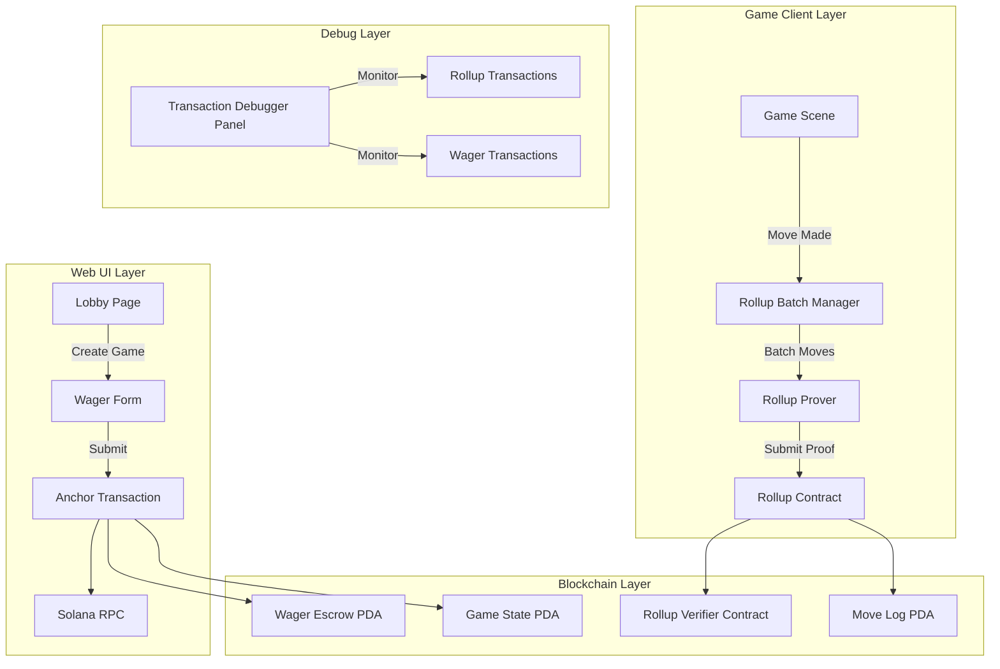
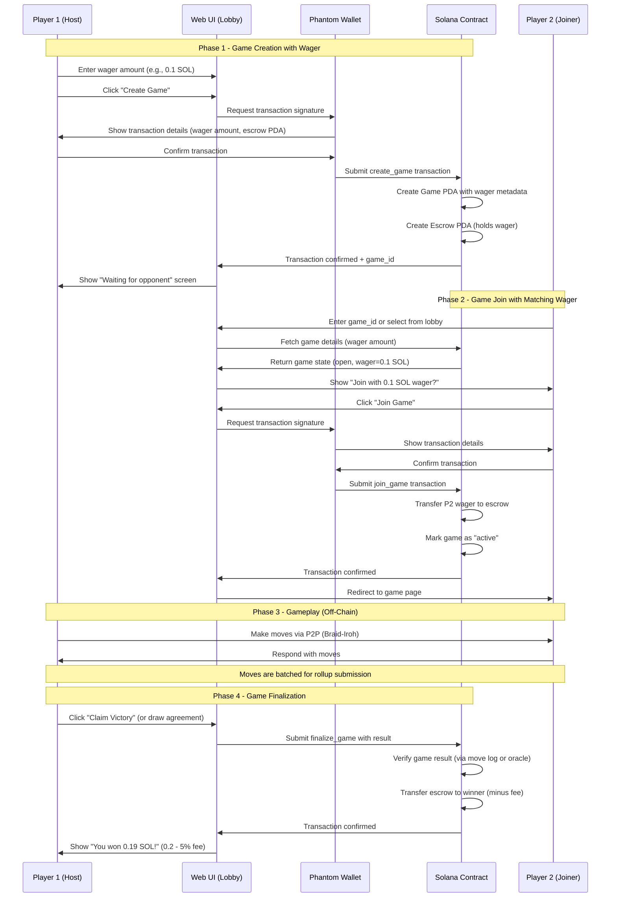
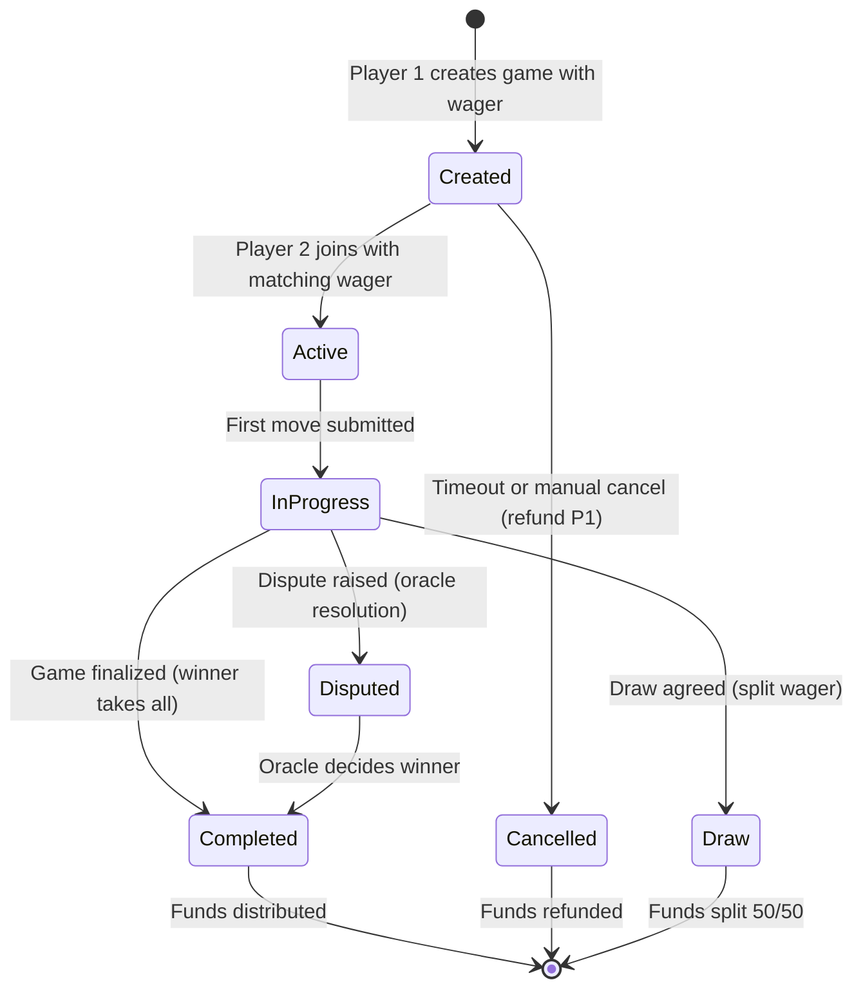
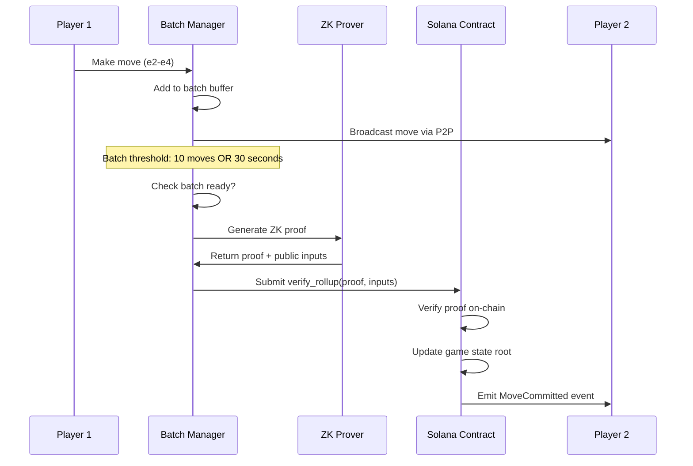

# XFChess Ephemeral Rollup + Wager Contract Integration Plan

## Executive Summary

This document provides a comprehensive end-to-end architecture for integrating:
1. **Web UI wager flow** (React frontend)
2. **Ephemeral rollup-based move submission** (off-chain execution with on-chain settlement)
3. **In-game transaction debugger** (real-time rollup transaction monitoring)

---

## Table of Contents

1. [System Architecture Overview](#system-architecture-overview)
2. [Wager Contract Flow](#wager-contract-flow)
3. [Ephemeral Rollup for Move Submission](#ephemeral-rollup-for-move-submission)
4. [Transaction Debugger Side Panel](#transaction-debugger-side-panel)
5. [File Structure & Module Organization](#file-structure--module-organization)
6. [Implementation Roadmap](#implementation-roadmap)
7. [Security Considerations](#security-considerations)
8. [References](#references)

---

## System Architecture Overview



### Key Components

| Component | Location | Responsibility |
|-----------|----------|----------------|
| Wager Manager | `web-solana/src/hooks/useWagerManager.ts` | Handle wager creation, join, finalization |
| Rollup Batch Manager | `src/multiplayer/rollup_batcher.rs` | Batch chess moves into rollup submissions |
| Rollup Prover | `src/multiplayer/rollup_prover.rs` | Generate ZK proofs for move batches |
| Transaction Debugger | `web-solana/src/components/TransactionDebugger.tsx` | Real-time transaction monitoring |
| Game Result Resolver | `programs/xfchess-game/src/instructions/finalize_game.rs` | Distribute wager based on game result |

---

## Wager Contract Flow

### Where is Wager Handled?

**Answer: The wager is handled in the WEB UI, not in-game.**

Rationale:
- Wager is a one-time setup action before the game starts
- Requires wallet interaction (signing transaction)
- Game client should focus on gameplay, not financial transactions
- Web UI provides better UX for wallet connection and confirmation

### Complete Wager Flow



### Wager Contract State Machine



### Web UI Wager Form Component

```typescript
// web-solana/src/components/WagerForm.tsx
interface WagerFormProps {
  onCreateGame: (wagerAmount: number, gameType: GameType) => Promise<void>;
  onJoinGame: (gameId: number, wagerAmount: number) => Promise<void>;
}

interface WagerState {
  amount: number;
  currency: 'SOL' | 'USDC';
  gameType: 'pvp' | 'pve';
  isLoading: boolean;
  error: string | null;
}
```

---

## Ephemeral Rollup for Move Submission

### What are Ephemeral Rollups?

Ephemeral rollups are **short-lived, game-specific rollup chains** that:
1. Batch multiple moves into a single on-chain transaction
2. Generate ZK proofs for move validity
3. Submit proof + state root to Solana contract
4. Are discarded after game completion (hence "ephemeral")

### Why Use Rollups for Chess?

| Problem | Solution |
|---------|----------|
| High gas fees for each move | Batch 10-50 moves per rollup submission |
| Slow confirmation times | Off-chain execution, async settlement |
| Move validation complexity | ZK proof verifies all moves at once |
| Network congestion | Reduce on-chain transactions by 90%+ |

### Rollup Architecture

```mermaid
flowchart LR
    subgraph Off-Chain (Game Client)
        A[Move 1: e2-e4] --> B[Rollup Batch Buffer]
        A2[Move 2: e7-e5] --> B
        A3[Move 3: Nf3] --> B
        A4[Move 4: Nc6] --> B
        
        B --> C{Batch Full?}
        C -->|Yes (10 moves)| D[Generate ZK Proof]
        C -->|No| E[Wait for more moves]
        
        D --> F[Submit to Solana]
    end
    
    subgraph On-Chain (Solana)
        F --> G[RollupVerifier Contract]
        G --> H{Verify Proof}
        H -->|Valid| I[Update State Root]
        H -->|Invalid| J[Reject + Penalty]
        I --> K[Emit MoveLog Event]
    end
```

### Rollup Batch Structure

```rust
// src/multiplayer/rollup_batcher.rs

/// A batch of chess moves to be submitted as a rollup
pub struct RollupBatch {
    pub game_id: u64,
    pub batch_id: u32,
    pub moves: Vec<RollupMove>,
    pub initial_state_root: [u8; 32],
    pub final_state_root: [u8; 32],
}

/// A single move in the rollup
pub struct RollupMove {
    pub from: (u8, u8),
    pub to: (u8, u8),
    pub piece_type: PieceType,
    pub captured: Option<PieceType>,
    pub promotion: Option<PieceType>,
    pub timestamp: u64,
}

/// Rollup proof submission to Solana
pub struct RollupProof {
    pub game_id: u64,
    pub batch_id: u32,
    pub proof: Vec<u8>,           // ZK proof bytes
    pub public_inputs: PublicInputs,
}

pub struct PublicInputs {
    pub initial_state_root: [u8; 32],
    pub final_state_root: [u8; 32],
    pub move_count: u32,
}
```

### Move Submission Flow



### ZK Proof Generation

For chess move validation, the ZK circuit verifies:
1. **Move legality**: Piece moves according to chess rules
2. **Turn order**: Correct player's turn
3. **Check/Checkmate detection**: King safety validation
4. **State transition**: FEN state root correctly updated

```rust
// src/multiplayer/rollup_prover.rs

pub struct ChessRollupCircuit {
    pub initial_board: [u8; 64],
    pub moves: Vec<VerifiedMove>,
    pub final_board: [u8; 64],
}

impl Circuit for ChessRollupCircuit {
    fn synthesize<CS: ConstraintSystem>(&self, cs: &mut CS) -> Result<()> {
        // Verify each move is legal given the board state
        for (i, move) in self.moves.iter().enumerate() {
            let board_state = self.get_board_at_turn(i);
            move.verify_legality(cs, &board_state)?;
        }
        
        // Verify final board state matches moves
        self.verify_final_state(cs)?;
        
        Ok(())
    }
}
```

---

## Transaction Debugger Side Panel

### Purpose

A developer-facing UI component that displays all transactions sent to the network in real-time, including:
- Wager transactions (create_game, join_game, finalize_game)
- Rollup submissions (verify_rollup)
- Move commits (record_move for non-rollup mode)
- Dispute resolutions

### UI Layout

```
┌─────────────────────────────────────────────────────────────┐
│  Game View                                                  │
│  ┌─────────────────────────────────────────────────────┐   │
│  │                                                     │   │
│  │              Chess Board                            │   │
│  │                                                     │   │
│  └─────────────────────────────────────────────────────┘   │
├─────────────────────────────────────────────────────────────┤
│  Transaction Debugger (Collapsible Side Panel)             │
│  ┌──────────────┬──────────────┬──────────────┬─────────┐ │
│  │ Timestamp    │ Type         │ Status       │ TX Hash │ │
│  ├──────────────┼──────────────┼──────────────┼─────────┤ │
│  │ 18:42:15.123 │ create_game  │ ✅ Confirmed│ 8x...3a │ │
│  │ 18:42:45.456 │ join_game    │ ✅ Confirmed│ 9y...4b │ │
│  │ 18:43:01.789 │ rollup_batch │ ⏳ Pending  │ 7z...5c │ │
│  │ 18:43:15.012 │ record_move  │ ✅ Confirmed│ 6a...6d │ │
│  │ 18:45:30.345 │ finalize_game│ ❌ Failed   │ 5b...7e │ │
│  └──────────────┴──────────────┴──────────────┴─────────┘ │
│                                                           │
│  [Export Logs] [Clear] [Auto-Scroll: ✓] [Filter: ▼]      │
└─────────────────────────────────────────────────────────────┘
```

### Transaction Types

| Type | Description | Data Displayed |
|------|-------------|----------------|
| `create_game` | Player 1 creates game with wager | game_id, wager_amount, escrow_pda |
| `join_game` | Player 2 joins game | game_id, wager_amount, player_2 |
| `rollup_batch` | Batch move submission | batch_id, move_count, proof_size |
| `record_move` | Single move (non-rollup) | move_str, from, to, piece |
| `finalize_game` | Game result submission | result, winner, payout |
| `dispute` | Dispute resolution | reason, oracle, evidence |

### Implementation

```typescript
// web-solana/src/components/TransactionDebugger.tsx

interface TransactionLog {
  id: string;
  timestamp: Date;
  type: TransactionType;
  status: 'pending' | 'confirmed' | 'failed';
  txHash?: string;
  data: Record<string, any>;
  error?: string;
}

interface TransactionDebuggerProps {
  isOpen: boolean;
  onToggle: () => void;
}

export const TransactionDebugger: React.FC<TransactionDebuggerProps> = ({
  isOpen,
  onToggle,
}) => {
  const [logs, setLogs] = useState<TransactionLog[]>([]);
  const [filter, setFilter] = useState<TransactionType | 'all'>('all');
  const [autoScroll, setAutoScroll] = useState(true);

  // Hook into transaction provider
  useTransactionMonitor((tx) => {
    setLogs((prev) => [...prev, tx]);
  });

  return (
    <div className={`debugger-panel ${isOpen ? 'open' : 'closed'}`}>
      <div className="debugger-header">
        <h3>Transaction Debugger</h3>
        <button onClick={onToggle}>Toggle</button>
      </div>
      
      <div className="debugger-filters">
        <select value={filter} onChange={(e) => setFilter(e.target.value)}>
          <option value="all">All Types</option>
          <option value="create_game">Create Game</option>
          <option value="join_game">Join Game</option>
          <option value="rollup_batch">Rollup Batch</option>
          <option value="record_move">Record Move</option>
          <option value="finalize_game">Finalize</option>
        </select>
        <label>
          <input
            type="checkbox"
            checked={autoScroll}
            onChange={(e) => setAutoScroll(e.target.checked)}
          />
          Auto-Scroll
        </label>
        <button onClick={() => exportLogs()}>Export Logs</button>
        <button onClick={() => setLogs([])}>Clear</button>
      </div>

      <div className="debugger-logs">
        <table>
          <thead>
            <tr>
              <th>Timestamp</th>
              <th>Type</th>
              <th>Status</th>
              <th>TX Hash</th>
              <th>Details</th>
            </tr>
          </thead>
          <tbody>
            {logs
              .filter((log) => filter === 'all' || log.type === filter)
              .map((log) => (
                <TransactionRow key={log.id} log={log} />
              ))}
          </tbody>
        </table>
      </div>
    </div>
  );
};
```

### Transaction Provider Hook

```typescript
// web-solana/src/hooks/useTransactionMonitor.ts

interface TransactionMonitor {
  logTransaction: (tx: Omit<TransactionLog, 'id' | 'timestamp'>) => void;
  updateTransactionStatus: (
    txHash: string,
    status: 'confirmed' | 'failed',
    error?: string
  ) => void;
}

export const useTransactionMonitor = (
  callback: (tx: TransactionLog) => void
): TransactionMonitor => {
  const connection = useConnection();
  const { publicKey } = useWallet();

  const logTransaction = useCallback(
    (txData: Omit<TransactionLog, 'id' | 'timestamp'>) => {
      const log: TransactionLog = {
        ...txData,
        id: generateId(),
        timestamp: new Date(),
      };
      callback(log);

      // Also log to console for debugging
      console.log('[TX DEBUG]', log);
    },
    [callback]
  );

  const updateTransactionStatus = useCallback(
    async (txHash: string, status: 'confirmed' | 'failed', error?: string) => {
      // Poll for confirmation
      const signature = await connection.confirmTransaction(txHash);
      
      callback({
        id: generateId(),
        timestamp: new Date(),
        type: 'status_update',
        status,
        txHash,
        data: { signature },
        error,
      });
    },
    [connection, callback]
  );

  return { logTransaction, updateTransactionStatus };
};
```

---

## File Structure & Module Organization

### Rust (Game Client)

```
src/
├── multiplayer/
│   ├── mod.rs                    # Module exports
│   ├── rollup_batcher.rs         # Move batching logic
│   ├── rollup_prover.rs          # ZK proof generation
│   ├── rollup_network_bridge.rs  # Bridge between P2P and rollup
│   ├── solana_integration.rs     # Solana transaction helpers
│   └── transaction_debugger.rs   # Debug logging for transactions
│
├── game/
│   ├── sync/
│   │   ├── mod.rs
│   │   ├── board_state.rs        # Board state sync (existing)
│   │   └── rollup_sync.rs        # Rollup-based sync (NEW)
│   └── systems/
│       ├── shared.rs             # Move execution (existing)
│       └── rollup_submit.rs      # Rollup submission trigger (NEW)
│
└── solana/
    ├── mod.rs
    ├── client.rs                 # Solana RPC client
    ├── instructions/
    │   ├── create_game.rs
    │   ├── join_game.rs
    │   ├── record_move.rs
    │   ├── verify_rollup.rs      # NEW
    │   └── finalize_game.rs
    └── pdas.rs                   # PDA derivation utilities
```

### TypeScript (Web UI)

```
web-solana/src/
├── components/
│   ├── WagerForm.tsx             # Wager creation/join form
│   ├── TransactionDebugger.tsx   # Side panel debugger
│   ├── GameCard.tsx              # Lobby game listing
│   └── RollupStatus.tsx          # Rollup batch status indicator
│
├── hooks/
│   ├── useWagerManager.ts        # Wager transaction management
│   ├── useRollupManager.ts       # Rollup batch management
│   ├── useGameProgram.ts         # Anchor program hook (existing)
│   └── useTransactionMonitor.ts  # Transaction debugging hook
│
├── contexts/
│   ├── GameProgramContext.tsx    # Anchor program provider
│   └── RollupContext.tsx         # Rollup state provider (NEW)
│
├── utils/
│   ├── pda.ts                    # PDA derivation (existing)
│   ├── anchor.ts                 # Anchor setup (existing)
│   └── rollup_proof.ts           # ZK proof helpers (NEW)
│
├── pages/
│   ├── Lobby.tsx                 # Updated with wager flow
│   ├── GameDetail.tsx            # Updated with rollup status
│   └── Debugger.tsx              # Standalone debugger page
│
└── types/
    ├── wager.ts                  # Wager-related types
    ├── rollup.ts                 # Rollup-related types
    └── transactions.ts           # Transaction log types
```

---

## Implementation Roadmap

### Phase 1: Wager Flow (Web UI)

| Task | File | Priority |
|------|------|----------|
| Create WagerForm component | `web-solana/src/components/WagerForm.tsx` | P0 |
| Implement useWagerManager hook | `web-solana/src/hooks/useWagerManager.ts` | P0 |
| Update Lobby.tsx with wager integration | `web-solana/src/pages/Lobby.tsx` | P0 |
| Add GameDetail.tsx join flow | `web-solana/src/pages/GameDetail.tsx` | P1 |
| Implement finalize_game UI | `web-solana/src/components/GameResult.tsx` | P1 |

### Phase 2: Rollup Infrastructure (Rust)

| Task | File | Priority |
|------|------|----------|
| Create RollupBatcher struct | `src/multiplayer/rollup_batcher.rs` | P0 |
| Implement move batching logic | `src/multiplayer/rollup_batcher.rs` | P0 |
| Create RollupProver with ZK circuit | `src/multiplayer/rollup_prover.rs` | P0 |
| Add verify_rollup instruction | `programs/xfchess-game/src/instructions/verify_rollup.rs` | P0 |
| Integrate with move execution | `src/game/systems/rollup_submit.rs` | P1 |

### Phase 3: Transaction Debugger

| Task | File | Priority |
|------|------|----------|
| Create TransactionDebugger component | `web-solana/src/components/TransactionDebugger.tsx` | P1 |
| Implement useTransactionMonitor hook | `web-solana/src/hooks/useTransactionMonitor.ts` | P1 |
| Add transaction logging to all hooks | All hook files | P2 |
| Create standalone Debugger page | `web-solana/src/pages/Debugger.tsx` | P2 |

### Phase 4: Integration & Testing

| Task | Priority |
|------|----------|
| End-to-end wager flow testing | P0 |
| Rollup batch submission testing | P0 |
| Debugger UI validation | P1 |
| Performance optimization (batch size, proof time) | P1 |
| Security audit (wager escrow, rollup validation) | P0 |

---

## Security Considerations

### Wager Escrow

1. **Escrow PDA Ownership**: Only the game contract can withdraw from escrow
2. **Timeout Refunds**: Automatic refund if game not started within 24 hours
3. **Dispute Resolution**: Oracle-based resolution for disputed games
4. **Fee Collection**: Platform fee (e.g., 5%) deducted from winner's payout

### Rollup Security

1. **Proof Verification**: On-chain verification of ZK proofs
2. **Fraud Proofs**: Challenge period for invalid state transitions
3. **Slashing**: Penalty for submitting invalid rollup batches
4. **Move Replay Protection**: Nonce-based prevention of move replay

### Data Privacy

1. **Move Encryption**: Optional encryption of moves during gameplay
2. **Result Privacy**: Only final result revealed on-chain
3. **Wager Privacy**: Wager amounts visible only to participants

---

## References

### Solana & Anchor

- [Anchor Documentation](https://www.anchor-lang.com/docs)
- [Solana Program Library](https://github.com/solana-labs/solana-program-library)
- [Solana Cookbook - PDAs](https://solanacookbook.com/core-concepts/pdas.html)

### ZK Rollups

- [zkSync Era Documentation](https://era.zksync.io/docs/)
- [StarkWare Cairo](https://www.cairo-lang.org/)
- [Risc0 ZK Prover](https://dev.risczero.com/)

### Chess on Blockchain

- [Chess.com API](https://www.chess.com/news/view/published-data-api)
- [Lichess API](https://lichess.org/api)
- [shakmaty (Rust chess library)](https://docs.rs/shakmaty/latest/shakmaty/)

### Previous Plans

- [`plans/solana-lobby-integration.md`](solana-lobby-integration.md) - Original lobby integration
- [`plans/board_state_sync_plan.md`](board_state_sync_plan.md) - Board state sync with Simpleton

---

## Appendix: Transaction Examples

### Create Game Transaction

```typescript
const createGameTx = async (wagerAmount: number) => {
  const gameId = Date.now(); // Unique game ID
  const [gamePDA, moveLogPDA, escrowPDA] = derivePDAs(gameId);
  
  const ix = await program.methods
    .createGame(new BN(gameId), new BN(wagerAmount * LAMPORTS_PER_SOL), GameType.PvP)
    .accounts({
      game: gamePDA,
      moveLog: moveLogPDA,
      escrow: escrowPDA,
      player1: wallet.publicKey,
      systemProgram: SystemProgram.programId,
    })
    .instruction();
  
  const tx = new Transaction().add(ix);
  const signature = await sendAndConfirmTransaction(connection, tx, [wallet]);
  
  return { signature, gameId };
};
```

### Rollup Batch Submission

```rust
// Rust game client
pub async fn submit_rollup_batch(
    client: &RpcClient,
    payer: &Keypair,
    batch: RollupBatch,
    proof: RollupProof,
) -> Result<Signature> {
    let instruction = create_verify_rollup_instruction(
        &program_id,
        &payer.pubkey(),
        batch.game_id,
        batch.batch_id,
        proof.proof,
        proof.public_inputs,
    );
    
    let recent_hash = client.get_latest_blockhash().await?;
    let tx = Transaction::new_signed_with_payer(
        &[instruction],
        Some(&payer.pubkey()),
        &[payer],
        recent_hash,
    );
    
    client.send_and_confirm_transaction(&tx).await
}
```
