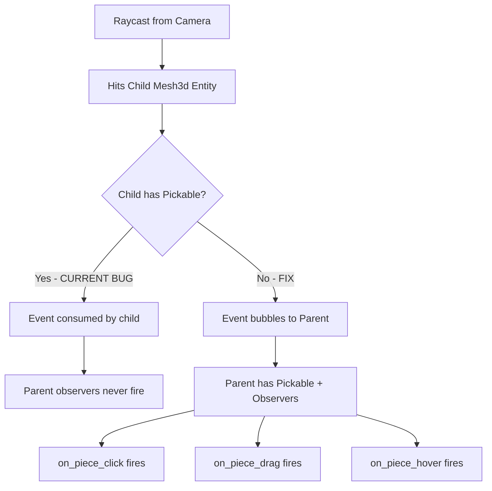

# Fix: Chess Pieces Floating Above Board & Picking Not Working

## Root Cause Analysis

### Issue 1: Pieces Spawning Above the Board

**File:** [`pieces.rs`](src/rendering/pieces/pieces.rs:304)

The per-piece-type offset constants all have `Y = 0.55`:

```rust
const KING_OFFSET: Vec3 = Vec3::new(-0.2, 0.55, -1.9);
const QUEEN_OFFSET: Vec3 = Vec3::new(-0.2, 0.55, -0.95);
const BISHOP_OFFSET: Vec3 = Vec3::new(-0.1, 0.55, 0.0);
const KNIGHT_OFFSET: Vec3 = Vec3::new(-0.2, 0.55, 0.9);
const ROOK_OFFSET: Vec3 = Vec3::new(-0.1, 0.55, 1.8);
const PAWN_OFFSET: Vec3 = Vec3::new(-0.2, 0.55, 2.6);
```

The comment says this is to compensate for the GLB model origin being at the geometric center, lifting the base up by half-height. However, the **main menu showcase** at [`main_menu_showcase.rs:291-303`](src/states/main_menu_showcase.rs:291) uses `Y = 0.0` for all offsets and pieces sit correctly on the board there:

```rust
// Showcase uses Y=0.0 offsets - pieces sit correctly
PieceType::King => vec![..., Vec3::new(-0.2, 0., -1.9)],
PieceType::Queen => vec![..., Vec3::new(-0.2, 0., -0.95)],
// etc.
```

The board squares are `Cuboid::new(1.0, 0.1, 1.0)` centered at `Y=0`, meaning the top surface is at `Y=0.05`. The parent piece entity is placed at `PIECE_ON_BOARD_Y = 0.0`. The child mesh offset of `Y=0.55` pushes the piece mesh 0.55 units above the parent, causing pieces to visually float above the board.

**Fix:** Change all per-piece Y offsets from `0.55` to `0.0`, matching the showcase behavior.

### Issue 2: Picking Not Working

**File:** [`pieces.rs`](src/rendering/pieces/pieces.rs:393)

The piece entity hierarchy is:

```
Parent Entity (has Piece, Pickable, PointerInteraction, observers)
  └── Child Entity (has Mesh3d, MeshMaterial3d, Pickable)
```

The problem is that **the parent entity has no `Mesh3d` component**. Bevy's picking system performs raycasting against meshes. When the user clicks, the ray hits the **child mesh entity** (which has `Mesh3d`), but the observers for click/drag/hover are registered on the **parent entity**. 

In Bevy's picking system, events bubble up from child to parent. However, the parent entity needs to be part of the picking hierarchy. The parent has `Pickable::default()` and `PointerInteraction::default()`, but without a mesh, the raycast never directly hits the parent. Events from child hits should bubble up to the parent, but the child entities spawned via the `spawn_piece_visual!` macro only have `Mesh3d`, `MeshMaterial3d`, `Transform`, and `Pickable` - they don't have `PointerInteraction`.

Looking more carefully at the picking flow:
1. Raycast hits child mesh (has `Mesh3d` + `Pickable`)
2. Event should bubble to parent (has observers)
3. But the child's `Pickable::default()` may be consuming the event without bubbling

**Fix:** The child mesh entities should NOT have `Pickable` set, OR the parent should have a transparent/invisible collision mesh. The cleanest fix is to remove `Pickable` from child meshes and ensure the parent entity has its own invisible collision mesh for raycasting.

## Detailed Fix Plan

### Step 1: Fix Piece Y-Offsets in [`pieces.rs`](src/rendering/pieces/pieces.rs)

Change all 6 offset constants from `Y=0.55` to `Y=0.0`:

```rust
const KING_OFFSET: Vec3 = Vec3::new(-0.2, 0.0, -1.9);
const QUEEN_OFFSET: Vec3 = Vec3::new(-0.2, 0.0, -0.95);
const BISHOP_OFFSET: Vec3 = Vec3::new(-0.1, 0.0, 0.0);
const KNIGHT_OFFSET: Vec3 = Vec3::new(-0.2, 0.0, 0.9);
const ROOK_OFFSET: Vec3 = Vec3::new(-0.1, 0.0, 1.8);
const PAWN_OFFSET: Vec3 = Vec3::new(-0.2, 0.0, 2.6);
```

Also update `PIECE_ON_BOARD_Y` to `0.05` so pieces sit on top of the board cuboid surface rather than clipping into it:

```rust
pub const PIECE_ON_BOARD_Y: f32 = 0.05;
```

Update the stale comments to match.

### Step 2: Fix Picking by Removing Pickable from Child Meshes

In the [`spawn_piece_visual!`](src/rendering/pieces/pieces.rs:393) macro, remove `bevy::picking::Pickable::default()` from child entities. Child meshes should not intercept picking events - only the parent entity should be pickable:

```rust
macro_rules! spawn_piece_visual {
    ($parent:expr, $mesh:expr, $material:expr, $offset:expr) => {
        $parent.spawn((
            Mesh3d($mesh),
            MeshMaterial3d($material),
            piece_mesh_transform($offset),
            // No Pickable here - let events bubble to parent
        ));
    };
}
```

### Step 3: Add Invisible Collision Mesh to Parent Piece Entity

Add a `Mesh3d` with a small invisible cuboid to each parent piece entity so the raycast can hit it directly. This is the standard Bevy pattern for pickable parent entities with visual children.

In each `spawn_*` function, add a collision mesh to the parent bundle. We need to create a shared collision mesh resource or add it inline. The simplest approach is to add a small cuboid mesh to the parent:

Each spawn function should include a collision mesh on the parent entity. We can create a `PieceCollisionMesh` resource loaded at startup, or pass a mesh handle through.

**Alternative simpler approach:** Instead of adding a mesh to the parent, we can keep `Pickable` on children but use `Pickable::IGNORE` on children so events pass through to the parent. Actually, the correct Bevy approach is to NOT put `Pickable` on children at all - Bevy's picking will bubble events from child mesh hits up to the parent automatically.

Let me verify: In Bevy 0.15+, picking events bubble from the hit entity up through the entity hierarchy. If a child mesh is hit, the `Pointer<Click>` event will trigger observers on parent entities. The issue might actually be that the child has `Pickable::default()` which could be blocking bubbling.

**Revised Step 2:** Remove `Pickable` from child mesh entities. The parent already has `Pickable` and observers. When the raycast hits the child mesh, the event should bubble up to the parent where the observers will fire.

### Step 4: Update `animate_piece_movement` in [`visual.rs`](src/game/systems/visual.rs:97)

The snap-to-board logic uses `PIECE_ON_BOARD_Y`. If we change it to `0.05`, this is already correct:

```rust
let target = Vec3::new(piece.x as f32, PIECE_ON_BOARD_Y, piece.y as f32);
```

No change needed here since it references the constant.

## Files to Modify

1. **[`src/rendering/pieces/pieces.rs`](src/rendering/pieces/pieces.rs)** - Fix Y offsets, fix picking macro, update PIECE_ON_BOARD_Y
2. No other files need changes - they all reference the constants

## Architecture Diagram



## Risk Assessment

- **Low risk**: Y-offset change is purely visual, matching the working showcase code
- **Low risk**: Removing `Pickable` from children is the standard Bevy pattern for parent-child picking
- **Testing**: Run the game, verify pieces sit on board, verify clicking pieces selects them
