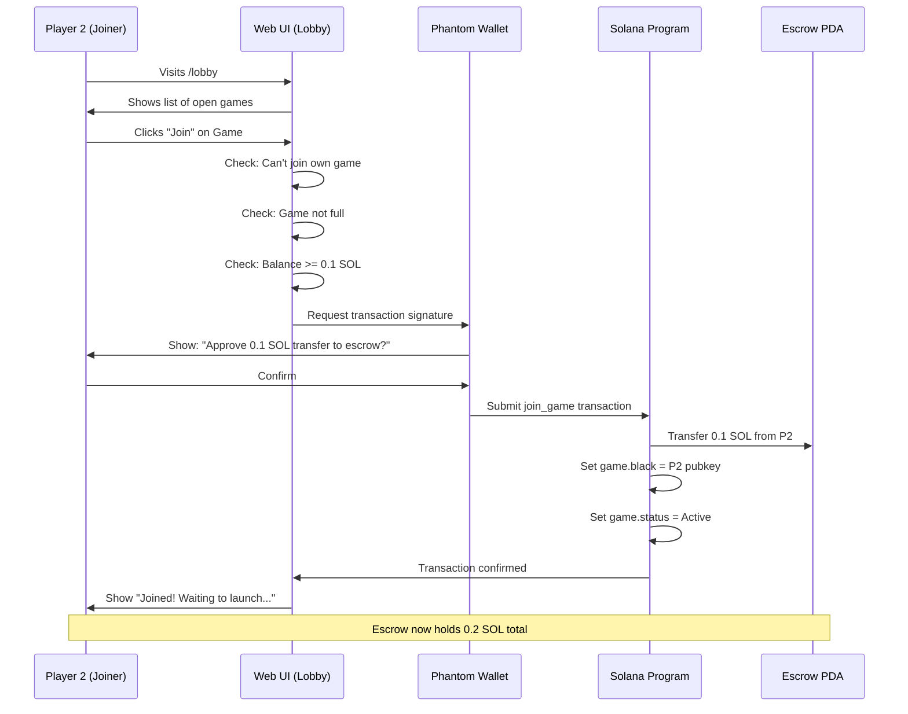
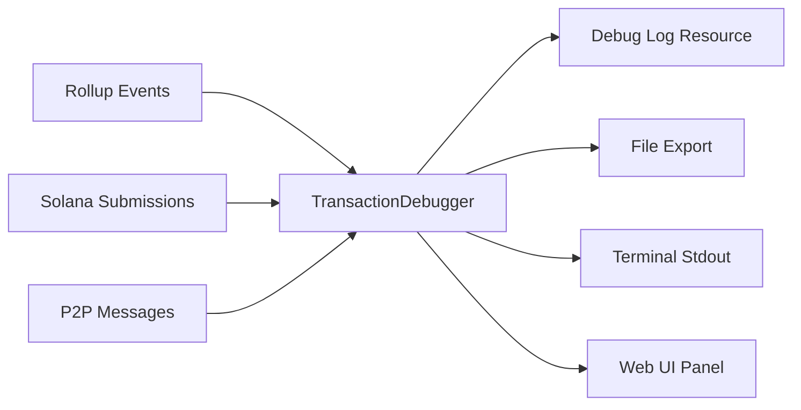
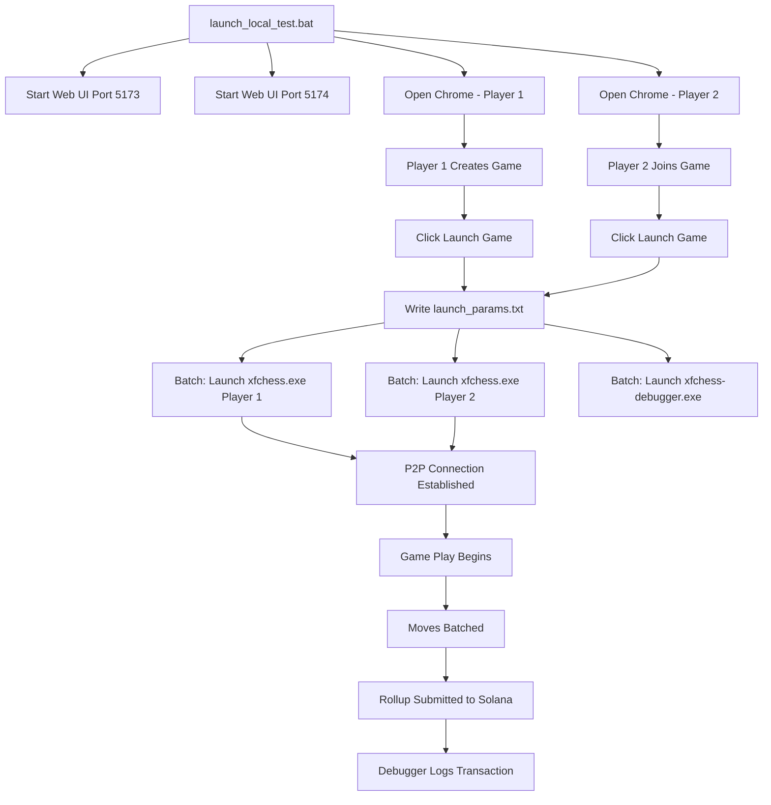

# XFChess MVP: Ephemeral Rollup + Wager Integration Plan

## Executive Summary

This document outlines the **MVP architecture** for integrating the existing Web UI wager flow with the game's ephemeral rollup system. **No ZK proofs** - just practical batching with session keys.

### What's Already Built (Existing Infrastructure)

| Component | Status | Location |
|-----------|--------|----------|
| Solana Program (Anchor) | ✅ Complete | `programs/xfchess-game/` |
| Web UI (React + Wallet) | ✅ Complete | `web-solana/src/` |
| P2P Networking (Braid-Iroh) | ✅ Complete | `src/multiplayer/` |
| Rollup Manager | ✅ Complete | `src/multiplayer/rollup_manager.rs` |
| Session Keys | ✅ Complete | `src/multiplayer/session_key_manager.rs` |
| Rollup Network Bridge | ✅ Complete | `src/multiplayer/rollup_network_bridge.rs` |
| Game Client (Bevy) | ✅ Complete | `src/game/` |

### What's Missing for MVP

1. **Transaction Debugger** - Side panel to monitor rollup transactions
2. **Web-to-Game Bridge** - Launch game client from web UI with game params
3. **Simplified Rollup Coordination** - Streamlined two-party signing

---

## End-to-End User Flow

### Phase 1: Wager Setup (Web UI)

```
┌─────────────────────────────────────────────────────────────────┐
│  User opens website → Connects Phantom Wallet                   │
│                        ↓                                        │
│  Clicks "Create Game" → Enters wager (0.1 SOL)                  │
│                        ↓                                        │
│  Signs transaction → SOL locked in escrow PDA                   │
│                        ↓                                        │
│  Game PDA created with game_id, wager_amount, player_white      │
│                        ↓                                        │
│  Web UI shows: "Waiting for opponent... Game ID: 12345"         │
└─────────────────────────────────────────────────────────────────┘
```

### Phase 2: Opponent Joins (Web UI)

```
┌─────────────────────────────────────────────────────────────────┐
│  Opponent visits lobby → Sees open game with 0.1 SOL wager      │
│                        ↓                                        │
│  Clicks "Join" → Signs transaction to match wager               │
│                        ↓                                        │
│  SOL transferred to escrow → Game status = "Active"             │
│                        ↓                                        │
│  Both players see: "Launch Game" button                         │
└─────────────────────────────────────────────────────────────────┘
```

### Phase 3: Launch Game Client (Web-to-Game Bridge)

```
┌─────────────────────────────────────────────────────────────────┐
│  Player clicks "Launch Game"                                    │
│                        ↓                                        │
│  Web UI generates launch params:                                │
│    - game_id: 12345                                             │
│    - player_color: white/black                                  │
│    - session_key: <ephemeral_keypair>                           │
│    - opponent_peer_id: <from game PDA>                          │
│    - wager_amount: 0.1 SOL                                      │
│                        ↓                                        │
│  Web UI calls: `xfchess.exe --game-id 12345 --session-key ...`  │
│                        ↓                                        │
│  Game client launches → Connects to P2P network                 │
│                        ↓                                        │
│  Session key authorized on-chain via `authorize_session_key`    │
└─────────────────────────────────────────────────────────────────┘
```

### Phase 4: Gameplay with Ephemeral Rollups (In-Game)

```
┌─────────────────────────────────────────────────────────────────┐
│  White moves e2-e4 → Move added to local batch                  │
│                        ↓                                        │
│  Black moves e7-e5 → Move added to local batch                  │
│                        ↓                                        │
│  ... (moves continue, batch fills or timer expires)             │
│                        ↓                                        │
│  BATCH READY (10 moves or 10 seconds)                           │
│                        ↓                                        │
│  Both clients sign batch with session keys                      │
│                        ↓                                        │
│  One client submits `commit_move_batch` to Solana               │
│                        ↓                                        │
│  Transaction confirmed → FEN updated on-chain                   │
│                        ↓                                        │
│  Transaction Debugger records: batch_hash, tx_sig, moves        │
└─────────────────────────────────────────────────────────────────┘
```

### Phase 2 Detailed: Player 2 Join Flow



#### Implementation Details

**Step 1: Lobby UI Shows Join Button**

From [`Lobby.tsx`](web-solana/src/pages/Lobby.tsx:535):
```typescript
{activeGames.map((game) => (
    <div key={game.gameId} className="game-card">
        <div className="wager">{game.wager.toFixed(3)} SOL</div>
        <div className="status">{game.status}</div>
        
        // Join button only shown if:
        // - Game status is 'waiting'
        // - You're not the creator
        // - Game has no opponent yet
        {game.status === 'waiting' &&
         game.white !== publicKey?.toBase58() &&
         !game.black && (
            <button onClick={() => handleJoinGame(game)}>
                Join
            </button>
        )}
    </div>
))}
```

**Step 2: Validation Before Join**

From [`Lobby.tsx`](web-solana/src/pages/Lobby.tsx:166):
```typescript
const handleJoinGame = async (game: GameData) => {
    // Can't join your own game
    if (game.white === publicKey?.toBase58()) {
        setResult({ type: 'error', message: 'You cannot join your own game' });
        return;
    }
    
    // Game must have room
    if (game.black) {
        setResult({ type: 'error', message: 'This game is already full' });
        return;
    }
    
    // Must have enough SOL for wager
    if (balance !== null && game.wager > balance) {
        setResult({ type: 'error', message: `Insufficient balance. You need ${game.wager} SOL` });
        return;
    }
    
    // Call Anchor program
    const gameId = new BN(game.gameId);
    const joinResult = await joinGame(gameId);
};
```

**Step 3: Anchor Transaction**

From [`useGameProgram.ts`](web-solana/src/hooks/useGameProgram.ts:153):
```typescript
const joinGame = useCallback(async (gameId: BN): Promise<JoinGameResult> => {
    // Derive same PDAs as Player 1
    const [gamePDA] = deriveGamePDA(gameId);
    const [escrowPDA] = deriveEscrowPDA(gameId);  // Same escrow!
    
    const signature = await program.methods
        .joinGame(gameId)
        .accounts({
            game: gamePDA,
            escrowPda: escrowPDA,      // Player 2 sends to same escrow
            player: wallet.publicKey,   // Player 2's wallet signs
            systemProgram: SystemProgram.programId,
        })
        .rpc();  // Wallet popup appears here
    
    return { signature, gamePDA };
}, [program, wallet.publicKey]);
```

**Step 4: Solana Program Processes Join**

From [`join_game.rs`](programs/xfchess-game/src/instructions/join_game.rs:1):
```rust
pub fn handler(ctx: Context<JoinGame>, game_id: u64) -> Result<()> {
    let game = &mut ctx.accounts.game;
    let wager_amount = game.wager_amount;  // Same as Player 1's wager
    
    // Transfer SOL from Player 2 to the SAME escrow PDA
    anchor_lang::system_program::transfer(
        CpiContext::new(
            ctx.accounts.system_program.to_account_info(),
            anchor_lang::system_program::Transfer {
                from: ctx.accounts.player.to_account_info(),  // P2 wallet
                to: ctx.accounts.escrow_pda.to_account_info(), // Same escrow
            },
        ),
        wager_amount,  // 0.1 SOL
    )?;
    
    // Update game state
    game.black = ctx.accounts.player.key();  // Set Player 2 as black
    game.status = GameStatus::Active;        // Game now active!
    
    Ok(())
};
```

| Component | File | Key Code |
|-----------|------|----------|
| Join button UI | [`Lobby.tsx:535`](web-solana/src/pages/Lobby.tsx:535) | `game.status === 'waiting' && game.white !== publicKey?.toBase58()` |
| Validation | [`Lobby.tsx:166`](web-solana/src/pages/Lobby.tsx:166) | `handleJoinGame(game)` |
| Anchor call | [`useGameProgram.ts:153`](web-solana/src/hooks/useGameProgram.ts:153) | `program.methods.joinGame(gameId)` |
| SOL transfer | [`join_game.rs`](programs/xfchess-game/src/instructions/join_game.rs:1) | `system_program::transfer(..., wager_amount)` |

### Phase 5: Game End (Web UI or In-Game)

```
┌─────────────────────────────────────────────────────────────────┐
│  Checkmate detected OR Player clicks "Claim Victory"            │
│                        ↓                                        │
│  Finalize transaction submitted: `finalize_game`                │
│                        ↓                                        │
│  Escrow released to winner (minus 5% fee)                       │
│                        ↓                                        │
│  Game status = "Finished" on-chain                              │
│                        ↓                                        │
│  Transaction Debugger shows final settlement                    │
└─────────────────────────────────────────────────────────────────┘
```

---

## MVP Architecture

### System Diagram

```mermaid
flowchart TB
    subgraph "Web UI Layer (React)"
        A[Wallet Connection] --> B[Lobby Page]
        B --> C[Create Game Form]
        B --> D[Join Game Button]
        C --> E[Anchor Transaction]
        D --> E
        E --> F[Game Detail Page]
        F --> G[Launch Game Button]
    end

    subgraph "Launch Bridge"
        G --> H[Generate Session Key]
        H --> I[Launch xfchess.exe]
        I --> J[Pass game_id, keys, peer info]
    end

    subgraph "Game Client (Bevy)"
        K[P2P Connection] --> L[Game Scene]
        L --> M[Rollup Manager]
        M --> N[Batch Moves]
        N --> O[Two-Party Sign]
        O --> P[Submit to Solana]
        Q[Transaction Debugger] --> M
    end

    subgraph "Solana Devnet"
        R[Game PDA]
        S[Escrow PDA]
        T[Session Delegation PDA]
        U[Move Log PDA]
    end

    E --> R
    E --> S
    P --> R
    P --> U
```



### Module Structure

```
web-solana/src/
├── components/
│   └── TransactionDebuggerPanel.tsx   # NEW: Web-based tx monitoring (optional)
├── hooks/
│   ├── useGameProgram.ts              # EXISTING: Anchor interactions
│   └── useGameLauncher.ts             # NEW: Launch game client
├── utils/
│   ├── pda.ts                         # EXISTING: PDA derivation
│   └── gameLauncher.ts                # NEW: Launch params & session key gen
└── pages/
    ├── Lobby.tsx                      # EXISTING
    └── GameDetail.tsx                 # MODIFIED: Add Launch button

src/
├── multiplayer/
│   ├── mod.rs                         # EXISTING
│   ├── rollup_manager.rs              # EXISTING: Batch management
│   ├── rollup_network_bridge.rs       # EXISTING: P2P coordination
│   ├── session_key_manager.rs         # EXISTING: Ephemeral keys
│   └── transaction_debugger.rs        # NEW: Terminal debug logging
├── bin/
│   └── debugger.rs                    # NEW: Standalone debugger binary
└── cli.rs                             # NEW: CLI argument parsing
```

---

## Transaction Debugger Design

### Philosophy
- **Idiomatic Rust**: Uses Bevy's ECS, events, and resources
- **Modular**: Separate crate/module, no tight coupling
- **Non-intrusive**: Doesn't affect game logic, only observes
- **Observable**: All rollup transactions recorded with full metadata

### Architecture



### Core Types

```rust
// src/multiplayer/transaction_debugger.rs

#[derive(Debug, Clone, Serialize, Deserialize)]
pub struct RollupTransaction {
    pub timestamp: u64,
    pub game_id: u64,
    pub tx_type: TransactionType,
    pub status: TransactionStatus,
    pub batch_hash: String,
    pub moves: Vec<String>,
    pub solana_signature: Option<String>,
    pub error: Option<String>,
}

#[derive(Debug, Clone)]
pub enum TransactionType {
    BatchProposed,      // Local batch ready
    BatchAccepted,      // Peer accepted
    BatchRejected,      // Peer rejected
    SolanaSubmitted,    // Sent to chain
    SolanaConfirmed,    // On-chain confirmed
    SolanaFailed,       // On-chain failed
}

#[derive(Resource)]
pub struct TransactionDebugger {
    pub transactions: Vec<RollupTransaction>,
    pub export_path: Option<PathBuf>,
    pub auto_export: bool,
}
```

### Integration Points

1. **Rollup Events**: Listens to `RollupEvent` messages
2. **Network Bridge**: Hooks into `RollupNetworkBridge` submissions
3. **Solana Integration**: Monitors transaction confirmations

### Terminal-Based Output (Not Egui)

The debugger runs as a **terminal sidecar process** (not in-game UI):

```rust
// src/multiplayer/transaction_debugger.rs

pub struct TransactionDebugger {
    pub transactions: Vec<RollupTransaction>,
    pub log_file: Option<File>,
    pub pretty_print: bool,  // Terminal colors
}

impl TransactionDebugger {
    pub fn log_event(&mut self, tx: RollupTransaction) {
        // Print to terminal with colors
        if self.pretty_print {
            println!("{}", self.format_colored(&tx));
        } else {
            println!("{}", serde_json::to_string(&tx).unwrap());
        }
        
        // Append to log file
        if let Some(ref mut file) = self.log_file {
            writeln!(file, "{}", serde_json::to_string(&tx).unwrap()).ok();
        }
        
        self.transactions.push(tx);
    }
    
    fn format_colored(&self, tx: &RollupTransaction) -> String {
        match tx.status {
            TransactionStatus::Confirmed => {
                format!("\x1b[32m[✓]\x1b[0m Batch {} confirmed | Tx: {}... | Moves: {}",
                    &tx.batch_hash[..8],
                    tx.solana_signature.as_ref().unwrap_or(&"N/A".to_string()).get(..16).unwrap_or(""),
                    tx.moves.len()
                )
            }
            TransactionStatus::Failed => {
                format!("\x1b[31m[✗]\x1b[0m Batch {} failed | Error: {}",
                    &tx.batch_hash[..8],
                    tx.error.as_ref().unwrap_or(&"Unknown".to_string())
                )
            }
            TransactionStatus::Pending => {
                format!("\x1b[33m[⟳]\x1b[0m Batch {} pending...", &tx.batch_hash[..8])
            }
        }
    }
}
```

### Running the Debugger

**Option 1: Sidecar Process (Separate Terminal)**
```bash
# Terminal 1: Run the game
./xfchess --game-id 12345 --player-color white

# Terminal 2: Run the debugger
./xfchess-debugger --game-id 12345 --log-file ./game_12345.log
```

**Option 2: Same Process, Log to File + Stdout**
```rust
// In main.rs, spawn debugger as async task
fn main() {
    // ... game setup ...
    
    // Spawn debugger task
    tokio::spawn(async move {
        let debugger = TransactionDebugger::new(
            Some(File::create("rollup_debug.log").unwrap()),
            true, // pretty print
        );
        
        // Listen to rollup events via channel/messaging
        while let Some(event) = rollup_event_rx.recv().await {
            debugger.log_event(event.into());
        }
    });
    
    app.run();
}
```

**Option 3: Web-Based Debugger View**
```typescript
// web-solana/src/components/TransactionDebugger.tsx
// Show real-time rollup events in the web UI
// Polls or WebSocket connection to game client
```

### Log Format

```json
{
  "timestamp": 1708886400,
  "game_id": 12345,
  "batch_hash": "a3f2b8c1d4e5f6...",
  "status": "Confirmed",
  "moves": ["e2e4", "e7e5", "g1f3", "b8c6"],
  "solana_signature": "5Kx...8Zq",
  "p2p_messages": [
    {"type": "BatchPropose", "from": "player1", "timestamp": 1708886395},
    {"type": "BatchAccept", "from": "player2", "timestamp": 1708886396},
    {"type": "TxSignature", "from": "player1", "timestamp": 1708886397},
    {"type": "TxSignature", "from": "player2", "timestamp": 1708886398}
  ]
}
```

### CLI Arguments

```rust
// src/cli.rs
#[derive(Parser)]
pub struct DebuggerArgs {
    #[arg(long)]
    game_id: u64,
    
    #[arg(long, default_value = "rollup_debug.log")]
    log_file: PathBuf,
    
    #[arg(long, default_value = "true")]
    pretty_print: bool,
    
    #[arg(long)]
    websocket_port: Option<u16>, // For web UI connection
}
```

---

## Implementation Phases

### Phase 1: Transaction Debugger (2-3 days)

**Goal**: Working terminal-based debugger that records all rollup activity

- [ ] Create `TransactionDebugger` resource with terminal output
- [ ] Implement event listeners for rollup flow
- [ ] Add colored stdout logging
- [ ] Export to JSON/CSV functionality
- [ ] Create standalone debugger binary
- [ ] Test with existing rollup manager

**Files to Create/Modify**:
- `src/multiplayer/transaction_debugger.rs` (NEW)
- `src/bin/debugger.rs` (NEW - standalone binary)
- `src/cli.rs` (NEW - CLI args)
- `src/multiplayer/mod.rs` (add plugin)

### Phase 2: Web-to-Game Bridge (2-3 days)

**Goal**: Launch game client from web UI with session keys

- [ ] Add session key generation in web UI
- [ ] Create game launcher utility
- [ ] Add "Launch Game" button to GameDetail page
- [ ] Pass params via command line or temp file
- [ ] Game client reads params on startup

**Files to Create/Modify**:
- `web-solana/src/utils/gameLauncher.ts` (NEW)
- `web-solana/src/hooks/useGameLauncher.ts` (NEW)
- `web-solana/src/pages/GameDetail.tsx` (MODIFY)
- `src/main.rs` (add CLI arg parsing)

### Phase 3: Wager Flow Integration (2 days)

**Goal**: Connect wager states between web and game

- [ ] Game client fetches game state from chain on launch
- [ ] Display wager amount in-game
- [ ] Prevent moves if wager not matched
- [ ] Show opponent connection status

**Files to Modify**:
- `src/multiplayer/solana_integration.rs`
- `src/ui/game_ui.rs`

### Phase 4: End-to-End Testing (2-3 days)

**Goal**: Full flow working on devnet

- [ ] Create game with wager (Web UI)
- [ ] Join game with wager (Web UI)
- [ ] Launch both game clients
- [ ] Play game with rollups
- [ ] Finalize and distribute wager
- [ ] Verify transaction debugger log

---

## Rollup Flow (Detailed)

### Without ZK Proofs (MVP)

```
Move 1: White plays e2-e4
    ↓
Move added to local batch
    ↓
Move 2: Black plays e7-e5
    ↓
Move added to local batch
    ↓
... (batch fills to 10 moves or 10s timeout)
    ↓
BATCH READY EVENT
    ↓
Both clients generate batch_hash = keccak256(moves + fens)
    ↓
Client A proposes: NetworkMessage::BatchPropose { moves, fens, hash }
    ↓
Client B validates: hash matches local, moves are legal
    ↓
Client B accepts: NetworkMessage::BatchAccept { hash }
    ↓
Both sign transaction with session keys
    ↓
Client A submits: commit_move_batch(game_id, moves, fens)
    ↓
Solana validates: both session signatures valid
    ↓
Move log updated, game.fen updated
    ↓
Client A broadcasts: NetworkMessage::Committed { tx_sig, new_fen }
    ↓
Transaction Debugger records all steps
```

### Security Model

| Threat | Mitigation |
|--------|------------|
| Invalid moves | Solana program validates FEN transitions (optional shakmaty feature) |
| Unauthorized batch | Requires both session key signatures |
| Replay attacks | Session keys expire after 2 hours |
| Censorship | Either player can submit the batch |
| Front-running | Not applicable - turn-based game |

---

## Key Design Decisions

### 1. Wager in Web UI, Not In-Game

**Rationale**:
- Wager is one-time setup
- Wallet UX is better in browser
- Game client focuses on gameplay
- Simpler game client code

### 2. Session Keys for Rollups

**Rationale**:
- Users sign once to authorize session
- Session keys sign all moves (gasless feel)
- 2-hour expiry for security
- No Metamask popup every move

### 3. Batching Every 10 Moves or 10 Seconds

**Rationale**:
- Reduces on-chain transactions by 10x
- Quick enough for dispute resolution
- Not too frequent to save costs
- Configurable per game

### 4. Transaction Debugger as Side Panel

**Rationale**:
- Developers need visibility into rollup flow
- Helps debug P2P coordination issues
- Audit trail for disputes
- Exportable for analysis

---

## File Structure (New Modules)

```
src/
├── multiplayer/
│   └── transaction_debugger.rs      # Core debugger logic (terminal output)
├── bin/
│   └── debugger.rs                  # Standalone debugger binary
└── cli.rs                            # CLI argument parsing

web-solana/src/
├── utils/
│   └── gameLauncher.ts              # Launch game client
├── hooks/
│   └── useGameLauncher.ts           # React hook
└── components/
    └── TransactionDebuggerPanel.tsx # Web-based debugger view (optional)
```

---

## Local Testing Setup (Batch File)

For local development and testing, create a batch file that launches the complete stack:

### `launch_local_test.bat`

```batch
@echo off
setlocal EnableDelayedExpansion

echo ==========================================
echo XFChess Local Test Environment Launcher
echo ==========================================
echo.

:: Configuration
set GAME_ID=12345
set WAGER_AMOUNT=0.01
set RPC_URL=https://api.devnet.solana.com
set PROGRAM_ID=AJwEwo74nRiZ3MPKX3XRh92rJaHj5ktPGRiY8kXhVozp

:: Paths
set WEB_UI_PATH=./web-solana
set GAME_EXE=./target/release/xfchess.exe
set DEBUGGER_EXE=./target/release/xfchess-debugger.exe

:: Step 1: Start Web UI (Player 1 - Host)
echo [1/5] Starting Web UI for Player 1 (Host)...
start "Player 1 - Web UI" cmd /k "cd %WEB_UI_PATH% && npm run dev -- --port 5173"
timeout /t 3 /nobreak >nul

:: Step 2: Start Web UI (Player 2 - Joiner)
echo [2/5] Starting Web UI for Player 2 (Joiner)...
start "Player 2 - Web UI" cmd /k "cd %WEB_UI_PATH% && npm run dev -- --port 5174"
timeout /t 3 /nobreak >nul

:: Step 3: Open browsers
echo [3/5] Opening browsers...
start chrome "http://localhost:5173" --window-name="Player 1"
timeout /t 2 /nobreak >nul
start chrome "http://localhost:5174" --window-name="Player 2"
timeout /t 2 /nobreak >nul

echo.
echo ==========================================
echo Setup Complete!
echo ==========================================
echo.
echo Instructions:
echo 1. Player 1: Connect wallet, create game with wager
echo 2. Player 2: Connect different wallet, join game
echo 3. Both: Click "Launch Game" button
echo 4. Game clients will launch automatically
echo.
echo Press any key after both players click "Launch Game"...
pause >nul

:: Step 4: Launch Game Clients
echo [4/5] Launching game clients...

:: Read game data from shared file (created by Web UI)
for /f "tokens=*" %%a in (./.local/game_launch_params.txt) do set GAME_PARAMS=%%a

:: Player 1 (White)
start "Player 1 - Game" cmd /k "%GAME_EXE% ^
    --game-id %GAME_ID% ^
    --player-color white ^
    --rpc-url %RPC_URL% ^
    --session-key %PLAYER1_SESSION% ^
    --p2p-port 5001"

:: Player 2 (Black)
start "Player 2 - Game" cmd /k "%GAME_EXE% ^
    --game-id %GAME_ID% ^
    --player-color black ^
    --rpc-url %RPC_URL% ^
    --session-key %PLAYER2_SESSION% ^
    --p2p-port 5002 ^
    --bootstrap-node %PLAYER1_NODE_ID%"

:: Step 5: Launch Transaction Debugger
echo [5/5] Launching transaction debugger...
start "Transaction Debugger" cmd /k "%DEBUGGER_EXE% ^
    --game-id %GAME_ID% ^
    --log-file ./debug/game_%GAME_ID%.log ^
    --pretty-print true ^
    --websocket-port 8765"

echo.
echo All processes launched!
echo Game ID: %GAME_ID%
echo Debugger log: ./debug/game_%GAME_ID%.log
echo.
pause
```

### Web UI Integration

The "Launch Game" button in [`GameDetail.tsx`](web-solana/src/pages/GameDetail.tsx:319) writes launch params to a file:

```typescript
// web-solana/src/utils/gameLauncher.ts
export async function writeLaunchParams(gameId: string, playerColor: string) {
    const sessionKey = generateSessionKey();
    
    const launchParams = {
        gameId,
        playerColor,
        sessionKey: sessionKey.secret,
        sessionPubkey: sessionKey.public,
        nodeId: await getNodeId(), // P2P node ID for connection
        timestamp: Date.now(),
    };
    
    // Write to shared file for batch file to read
    await fs.writeFile(
        './.local/game_launch_params.txt',
        JSON.stringify(launchParams)
    );
    
    // Also launch directly if not using batch file
    launchGameClient(launchParams);
}
```

### Game Client CLI Arguments

```rust
// src/cli.rs
#[derive(Parser)]
pub struct GameArgs {
    #[arg(long)]
    game_id: u64,
    
    #[arg(long)]
    player_color: PlayerColor, // white or black
    
    #[arg(long)]
    rpc_url: String,
    
    #[arg(long)]
    session_key: String, // Base58 encoded keypair
    
    #[arg(long)]
    p2p_port: u16,
    
    #[arg(long)]
    bootstrap_node: Option<String>, // Node ID to connect to (for Player 2)
}
```

### What the Batch File Does



---

## Testing Strategy

### Unit Tests
- PDA derivation
- Session key generation
- Batch hash calculation
- Transaction log serialization

### Integration Tests
- Create game → Join → Launch → Play → Finalize
- Rollup batch submission
- Transaction debugger recording
- Session key expiry

### Manual Testing
1. Open two browser tabs (Player 1, Player 2)
2. Player 1 creates game with 0.01 SOL wager
3. Player 2 joins game
4. Both click "Launch Game"
5. Play 15-20 moves
6. Verify rollups submitted
7. One player claims victory
8. Verify escrow distributed

---

## References

- [Existing Rollup Manager](src/multiplayer/rollup_manager.rs)
- [Rollup Network Bridge](src/multiplayer/rollup_network_bridge.rs)
- [Session Key Manager](src/multiplayer/session_key_manager.rs)
- [Anchor Program - Commit Move Batch](programs/xfchess-game/src/instructions/commit_move_batch.rs)
- [Web UI - useGameProgram Hook](web-solana/src/hooks/useGameProgram.ts)
