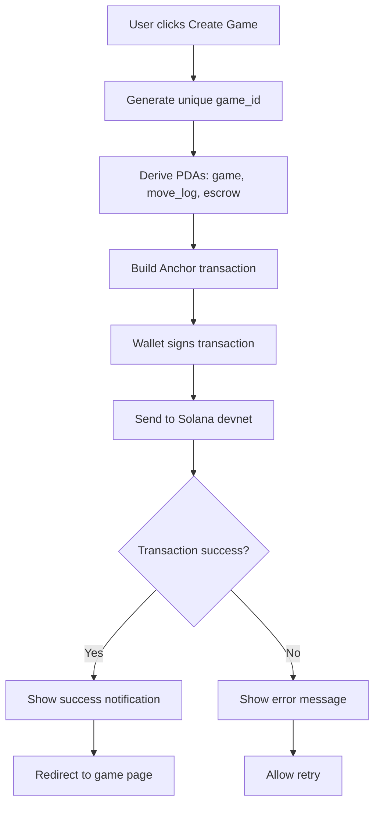

# Solana Lobby Integration Plan

## Project Overview

Integrate the XFChess Anchor program with the web-solana React frontend to enable creating wager-based chess games on Solana devnet.

## Current State Analysis

### Lobby.tsx (Current)
- Uses `@solana/wallet-adapter-react` for wallet connection
- Has placeholder `handleCreateGame` function (just logs to console)
- Supports PvP and PvAI game types
- No actual blockchain transaction implementation

### Anchor Program Structure (from IDL)

**Program ID:** `AJwEwo74nRiZ3MPKX3XRh92rJaHj5ktPGRiY8kXhVozp`

**Key Instructions:**
1. `create_game(game_id: u64, wager_amount: u64, game_type: GameType)` - Creates game with wager escrow
2. `join_game(game_id: u64)` - Second player joins
3. `record_move(game_id: u64, move_str: String, next_fen: String)` - Records chess moves
4. `finalize_game(game_id: u64, result: GameResult)` - Ends game and distributes wager

**PDA Seeds (from IDL constants):**
- Game: `["game", game_id]`
- Move Log: `["move_log", game_id]`
- Escrow: `["escrow", game_id]`

**GameType Enum:**
```typescript
{ PvP: {}, PvAI: {} }
```

## Implementation Architecture

### Mermaid Flow Diagram



## File Structure

```
web-solana/src/
├── idl/
│   └── xfchess_game.json          # Copied from target/idl/
├── utils/
│   ├── pda.ts                     # PDA derivation functions
│   └── anchor.ts                  # Anchor provider setup
├── hooks/
│   └── useGameProgram.ts          # React hook for program interaction
├── contexts/
│   └── GameProgramContext.tsx     # Anchor program context provider
└── pages/
    └── Lobby.tsx                  # Updated with blockchain integration
```

## Implementation Steps

### Step 1: Copy IDL File
- Source: `target/idl/xfchess_game.json`
- Destination: `web-solana/src/idl/xfchess_game.json`

### Step 2: PDA Utility Functions (utils/pda.ts)
```typescript
export const deriveGamePDA = (gameId: BN, programId: PublicKey) =>
  PublicKey.findProgramAddressSync(
    [Buffer.from("game"), gameId.toArrayLike(Buffer, "le", 8)],
    programId
  );

export const deriveMoveLogPDA = (gameId: BN, programId: PublicKey) =>
  PublicKey.findProgramAddressSync(
    [Buffer.from("move_log"), gameId.toArrayLike(Buffer, "le", 8)],
    programId
  );

export const deriveEscrowPDA = (gameId: BN, programId: PublicKey) =>
  PublicKey.findProgramAddressSync(
    [Buffer.from("escrow"), gameId.toArrayLike(Buffer, "le", 8)],
    programId
  );
```

### Step 3: Anchor Provider Setup (utils/anchor.ts)
- Create `AnchorProvider` using `useConnection` and `useWallet`
- Load IDL and create `Program` instance
- Export typed program interface

### Step 4: Custom Hook (hooks/useGameProgram.ts)
```typescript
export function useGameProgram() {
  const { connection } = useConnection();
  const wallet = useWallet();
  const [program, setProgram] = useState<Program<XfchessGame> | null>(null);
  
  // Initialize program on mount
  // Return { program, createGame, isLoading, error }
}
```

### Step 5: Create Game Transaction
```typescript
const createGame = async (wagerAmount: number, gameType: 'pvp' | 'pvai') => {
  const gameId = new BN(Date.now());
  const wagerLamports = new BN(wagerAmount * LAMPORTS_PER_SOL);
  const gameTypeValue = gameType === 'pvp' ? { PvP: {} } : { PvAI: {} };
  
  await program.methods
    .createGame(gameId, wagerLamports, gameTypeValue)
    .accounts({
      game: gamePDA,
      moveLog: moveLogPDA,
      escrowPda: escrowPDA,
      player: wallet.publicKey,
      systemProgram: SystemProgram.programId,
    })
    .rpc();
};
```

### Step 6: Enhanced Lobby.tsx
- Add loading state (`isCreating`)
- Add error state with user-friendly messages
- Add success notification/toast
- Disable button during transaction
- Show transaction signature on success
- Option to view on Solana Explorer

## Error Handling Strategy

| Error Code | User Message |
|------------|--------------|
| Wallet not connected | "Please connect your wallet first" |
| Insufficient balance | "Insufficient SOL balance for wager" |
| Transaction failed | "Transaction failed. Please try again" |
| User rejected | "Transaction cancelled by user" |
| Network error | "Network error. Check your connection" |

## Testing Plan

1. **Unit Test:** PDA derivation functions
2. **Integration Test:** Create game with 0.001 SOL wager
3. **Explorer Verification:** Check game account on devnet
4. **CLI Test:** Use `solana account <gamePDA>` to verify

## Dependencies

Already installed in web-solana:
- `@coral-xyz/anchor` ^0.32.1
- `@solana/web3.js` ^1.98.4
- `@solana/wallet-adapter-react` ^0.15.39

## Success Criteria

- [ ] User can create a PvP game with SOL wager
- [ ] User can create a PvAI game with SOL wager
- [ ] Game PDA is created on devnet
- [ ] SOL is transferred to escrow PDA
- [ ] Loading states prevent double-submission
- [ ] Error messages are user-friendly
- [ ] Success notification shows transaction signature
